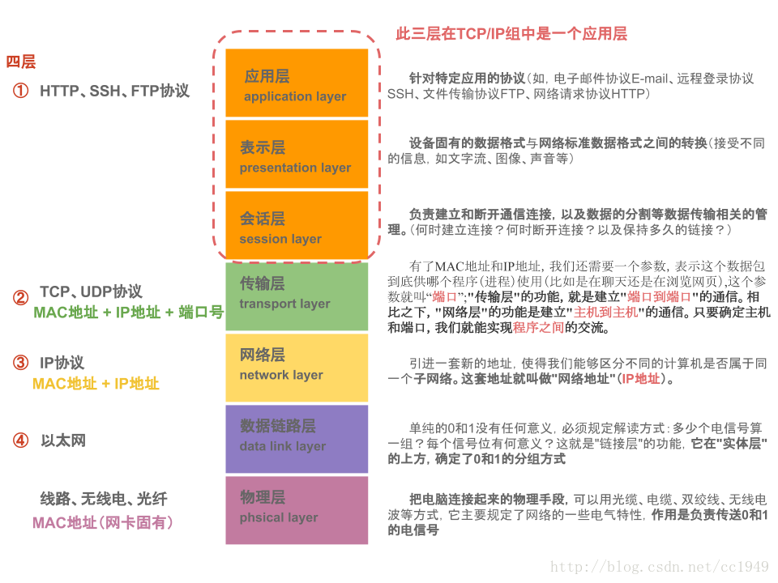
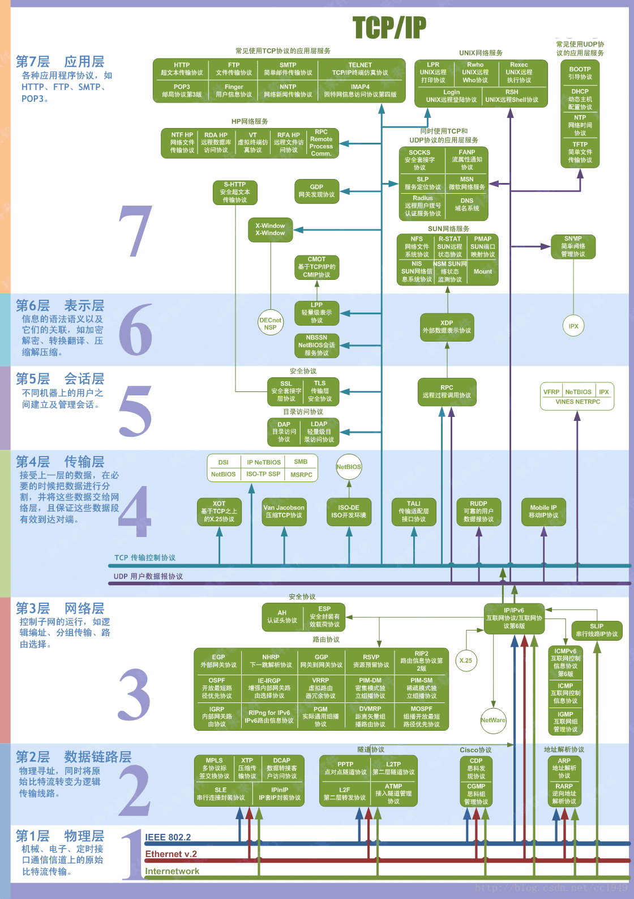

## 互联网架构

OSI(Open System Interconnection，开放系统互连)七层网络模型称为开放式系统互联参考模型 ，是一个逻辑上的定义，一个规范，它把网络从逻辑上分为了7层。每一层都有相关、相对应的物理设备，比如路由器，交换机。 

  

  

  

  

各层网络所使用协议如下：

- 物理层：RJ45、CLOCK、IEEE802.3 （中继器，集线器）
- 数据链路：PPP、FR、HDLC、VLAN、MAC （网桥，交换机）
- 网络层：IP、ICMP、ARP、RARP、OSPF、IPX、RIP、IGRP、 （路由器）
- 传输层：TCP、UDP、SPX
- 会话层：NFS、SQL、NETBIOS、RPC
- 表示层：JPEG、MPEG、ASII
- 应用层：FTP、DNS、Telnet、SMTP、HTTP、WWW、NFS

### 物理层

把电脑连起来，可以用光缆、电缆、双绞线、无线电波等方式。  主要规定了网络的一些电气特性，作用是负责传送0和1的电信号。 

### 数据链接层 

在"实体层"的上方，确定了0和1的分组方式。 

- 以太网协议

   以太网规定，一组电信号构成一个数据包，叫做"帧"（Frame）。每一帧分成两个部分：标头（Head）和数据（Data）。  "标头"包含数据包的一些说明项，比如发送者、接受者、数据类型等等；"数据"则是数据包的具体内容。 

    

-  MAC地址 

   以太网规定，连入网络的所有设备，都必须具有"网卡"接口。数据包必须是从一块网卡，传送到另一块网卡。网卡的地址，就是数据包的发送地址和接收地址，这叫做MAC地址。  

  每块网卡出厂的时候，都有一个全世界独一无二的MAC地址，长度是48个二进制位，通常用12个十六进制数表示。 

    

   前6个十六进制数是厂商编号，后6个是该厂商的网卡流水号。有了MAC地址，就可以定位网卡和数据包的路径了。 

-  广播  （broadcasting） 

   以太网采用了一种很"原始"的方式，它不是把数据包准确送到接收方，而是向本网络内所有计算机发送，让每台计算机自己判断，是否为接收方。 

### 网络层 

以太网采用广播方式发送数据包，所有成员人手一"包"，不仅效率低，而且局限在发送者所在的子网络。也就是说，如果两台计算机不在同一个子网络，广播是传不过去的。

"网络层"的作用是引进一套新的地址，使得我们能够区分不同的计算机是否属于同一个子网络。这套地址就叫做"网络地址"，简称"网址"。

-  IP协议 

  规定网络地址的协议，叫做IP协议。它所定义的地址，就被称为IP地址。 

  -  本机IP地址 

  -  子网掩码"（subnet mask） ： 判断两台计算机是否属于同一个子网络呢？ 

    比如，IP地址172.16.254.1，如果已知网络部分是前24位，主机部分是后8位，那么子网络掩码就是11111111.11111111.11111111.00000000，写成十进制就是255.255.255.0。

     将两个IP地址与子网掩码分别进行AND运算（两个数位都为1，运算结果为1，否则为0），然后比较结果是否相同，如果是的话，就表明它们在同一个子网络中，否则就不是。  

  -  网关的IP地址 

  -  DNS的IP地址

  -  IP数据包 

     根据IP协议发送的数据，就叫做IP数据包。 可以把IP数据包直接放进以太网数据包的"数据"部分，因此完全不用修改以太网的规格。  IP数据包也分为"标头"和"数据"两个部分。 见下图红色部分。

      

     "标头"部分主要包括版本、长度、IP地址等信息，"数据"部分则是IP数据包的具体内容。 

- ARP协议 

   IP数据包是放在以太网数据包里发送的，所以我们必须同时知道两个地址，一个是对方的MAC地址，另一个是对方的IP地址。通常情况下，对方的IP地址是已知的，但是我们不知道它的MAC地址。 

  -  两台主机不在同一个子网络

    没有办法得到对方的MAC地址，只能把数据包传送到两个子网络连接处的"网关"（gateway），让网关去处理。 

  -  两台主机在同一个子网络 

     用ARP协议，得到对方的MAC地址。ARP协议也是发出一个数据包（包含在以太网数据包中），其中包含它所要查询主机的IP地址，在对方的MAC地址这一栏，填的是FF:FF:FF:FF:FF:FF，表示这是一个"广播"地址。它所在子网络的每一台主机，都会收到这个数据包，从中取出IP地址，与自身的IP地址进行比较。如果两者相同，都做出回复，向对方报告自己的MAC地址，否则就丢弃这个包。 

### 传输层

同一台主机上有许多程序都需要用到网络， 需要一个参数，表示这个数据包到底供哪个程序（进程）使用。这个参数就叫做"端口"（port） 。 "端口"是0到65535之间的一个整数，正好16个二进制位。0到1023的端口被系统占用，用户只能选用大于1023的端口。 

 "传输层"的功能，就是建立"端口到端口"的通信。相比之下，"网络层"的功能是建立"主机到主机"的通信。只要确定主机和端口，我们就能实现程序之间的交流。

- UDP协议

   必须在数据包中加入端口信息，这就需要新的协议。最简单的实现叫做UDP协议。  UDP数据包，也是由"标头"和"数据"两部分组成。 见下图绿色部分。

    

   "标头"部分主要定义了发出端口和接收端口，"数据"部分就是具体的内容。 

- TCP协议

   UDP协议的优点是比较简单，容易实现，但是缺点是可靠性较差，一旦数据包发出，无法知道对方是否收到。 

   为了解决这个问题，提高网络可靠性，TCP协议就诞生了。这个协议非常复杂，但可以近似认为，它就是有确认机制的UDP协议，每发出一个数据包都要求确认。如果有一个数据包遗失，就收不到确认，发出方就知道有必要重发这个数据包了。 

### 应用层

应用程序收到"传输层"的数据，接下来就要进行解读。由于互联网是开放架构，数据来源五花八门，必须事先规定好格式，否则根本无法解读。"应用层"的作用，就是规定应用程序的数据格式。

- 会话层：任务就是向两个实体的表示层提供建立和使用连接的方法。
- 表示层：它对来自应用层的命令和数据进行解释，对各种语法赋予相应的含义，并按照一定的格式传送给会话层
- 应用层：应用层为用户提供的服务和协议有：文件服务、目录服务、文件传输服务（FTP）、远程登录服务（Telnet）、电子邮件服务（E-mail）、打印服务、安全服务、网络管理服务、数据库服务等

 

- DHCP协议

   		

  1. 最前面的"以太网标头"，设置发出方（本机）的MAC地址和接收方（DHCP服务器）的MAC地址。前者就是本机网卡的MAC地址，后者这时不知道，就填入一个广播地址：FF-FF-FF-FF-FF-FF。

  2. 后面的"IP标头"，设置发出方的IP地址和接收方的IP地址。这时，对于这两者，本机都不知道。于是，发出方的IP地址就设为0.0.0.0，接收方的IP地址设为255.255.255.255。
  3. 最后的"UDP标头"，设置发出方的端口和接收方的端口。这一部分是DHCP协议规定好的，发出方是68端口，接收方是67端口。

   这个数据包构造完成后，就可以发出了。以太网是广播发送，同一个子网络的每台计算机都收到了这个包。因为接收方的MAC地址是FF-FF-FF-FF-FF-FF，看不出是发给谁的，所以每台收到这个包的计算机，还必须分析这个包的IP地址，才能确定是不是发给自己的。当看到发出方IP地址是0.0.0.0，接收方是255.255.255.255，于是DHCP服务器知道"这个包是发给我的"，而其他计算机就可以丢弃这个包。 

   接下来，DHCP服务器读出这个包的数据内容，分配好IP地址，发送回去一个"DHCP响应"数据包。这个响应包的结构也是类似的，以太网标头的MAC地址是双方的网卡地址，IP标头的IP地址是DHCP服务器的IP地址（发出方）和255.255.255.255（接收方），UDP标头的端口是67（发出方）和68（接收方），分配给请求端的IP地址和本网络的具体参数则包含在Data部分。

   新加入的计算机收到这个响应包，于是就知道了自己的IP地址、子网掩码、网关地址、DNS服务器等等参数。

-  DNS协议 

   发送数据包，必须要知道对方的IP地址。[DNS协议](http://en.wikipedia.org/wiki/Domain_Name_System)可以将网址转换成IP地址。

    

### 总结

 新加入的计算机通过DHCP服务，知道了自己的IP地址、子网掩码、网关地址、DNS服务器等等参数。

而当访问一个网站（比如：www.google.com）的时候，需要发送如下信息。

- 以太网标头

  - 发出方（本机）的MAC地址： 已知
  - **接收方的MAC地址：未知**
    1. 获取接收方IP
    2. 通过IP和子网掩码计算，判断是否属于同一子网络：
       - 同一子网：通过ARP请求，获取MAC地址
       - 不同子网：发送给网关，由网关获取。

- IP标头

  - 发出方的IP地址：已知。一般通过DHCP获取。

  - **接收方的IP地址：未知。**

    通过DNS请求，获取

- TCP标头

  - 发出方端口：已知
  - 接收方端口：已知
  - 其他：

- 数据包：已知

上面有两个未知变量：`接收方的IP地址`和`接收方的MAC地址`，下图是它们的获取过程，有两条路径：

- 1>2>3>4>5
- 1>2>3>6>7>8>9

~~~mermaid
graph TB; 	
    A[visit website] --> |1.web site/DNS|B(DNS server)
    B --> |2. target IP|A
    A --> |3. target IP+subnet mask|C{same child netowrk?}
    C --> |4. Y: target IP/ARP| D(child network)
    C --> |6. N: target IP| E(Local Gateway) 
    D --> |5. target MAC|A
    E --> F(target Gateway)
    F --> |7. target IP/ARP|G(target child network)
    G --> |8. target MAC|F
    F --> E
    E --> |9. target MAC|A

~~~

## 参考

- [联网协议入门（一）](http://www.ruanyifeng.com/blog/2012/05/internet_protocol_suite_part_i.html )
- [互联网协议入门（二）](http://www.ruanyifeng.com/blog/2012/06/internet_protocol_suite_part_ii.html )
- [网络7层协议，4层，5层？理清容易混淆的几个概念](https://blog.csdn.net/cc1949/article/details/79063439 )