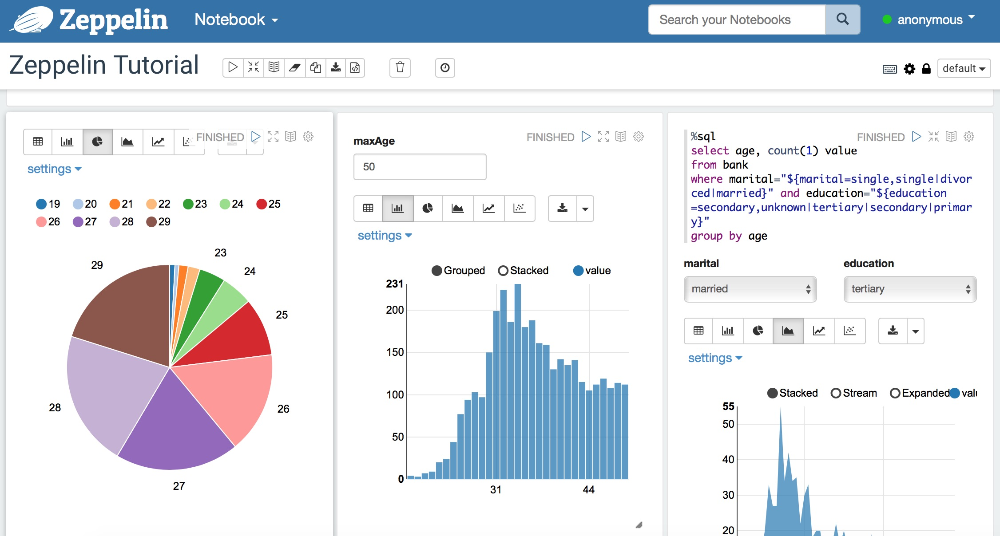
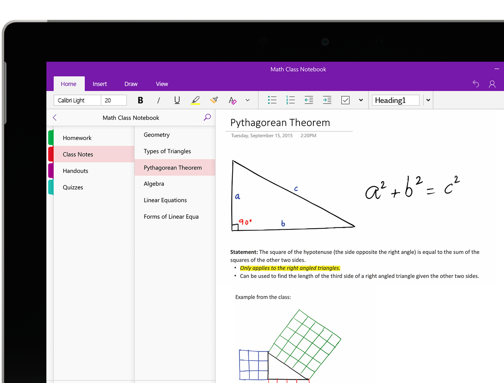
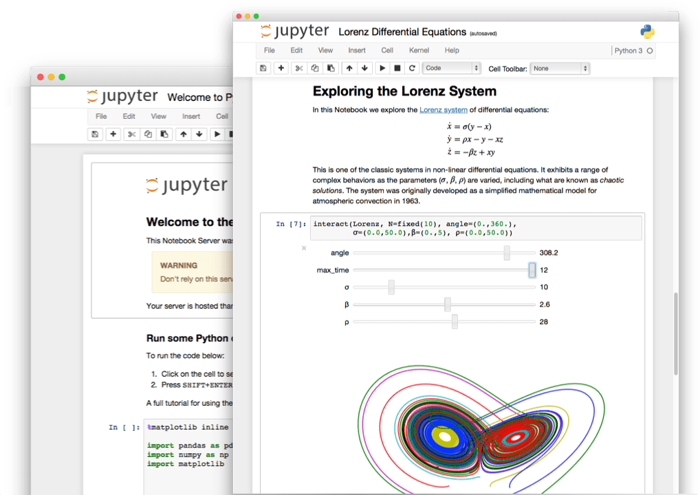
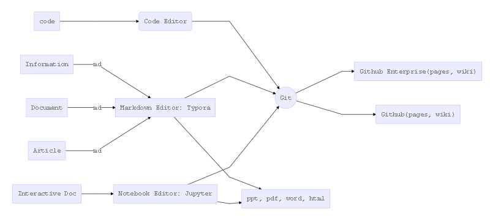
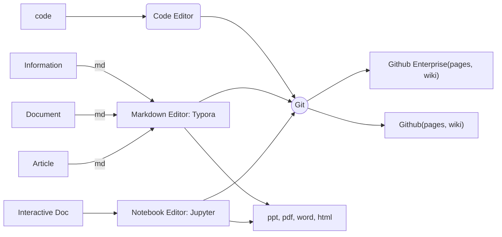
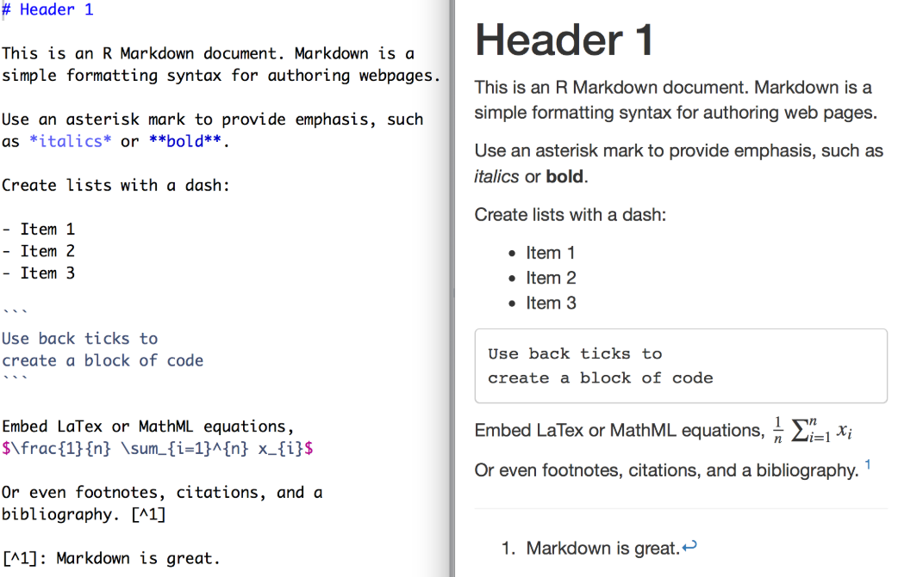
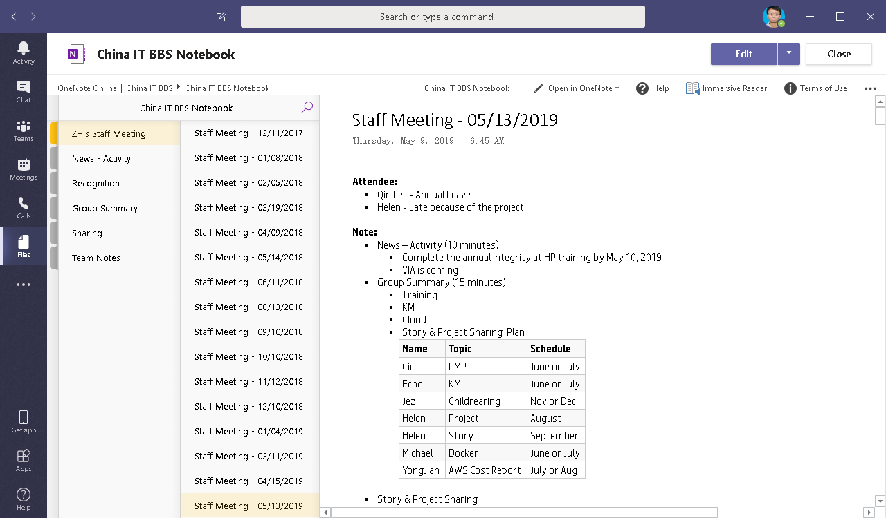

<!-- page_number: true -->

记笔记
==

###### Created by Xu Jian
###### May, 2019


---

# 前言

作为一个技术宅，很喜欢学习一些自己感兴趣的技术，在学习的过程中，深感记笔记非常的重要。


---

# 笔记

笔记记得好，即使过上几年，再次翻看，还能记忆犹新。

---

## 笔记类别

从程序员的眼中，笔记可以分为：

- 信息：任何你想记录的
- 代码：程序代码
- 文档：个人，项目或者团队的活动中的内容
- 交互文档：混合了代码，图表和文档
- 文章：相对正式，常用wiki，blog等发布

> *一篇笔记，可以属于多个类别*

---


### 交互文档：jupyter notebook， zeppelin

学习Spark的时，接触了zeppelin，它采用scala和sql等语言编写代码，用markdown来编写文档。



> *[juputer notebook example](http://15.15.165.218:18888/notebooks/eipi10/xuxiangwen.github.io/base/model_evaluation.ipynb)*

---


## 什么是好笔记

- 好理解： 好的笔记是容易理解的
- 易于复现：好的笔记，也应该是容易被重现的
- 持续更新


---

## 笔记的安全性

笔记发布的安全性非常重要。不同的笔记也有不同的发布范围。

- Internet：

  - 公开。没有安全性限制
  - 私有。信息是私有的，但可以授权任意的人员来访问

---

- 公司：仅在公司内部网络才可以访问。

  - 公司/部门：信息在公司或部门内部是公开的
  - 项目：信息在项目组内部是公开的
  - 私有：信息是私有的，可以授权公司同事访问

---

# 工具

任何工具的流行，离不开需求，也离不开合适的环境。

---

## 历史

个人而言，使用的工具经历了以下的过程。
- 原始社会：文本文件，word，excel文件
- 工业时代：evernote， onenote， 有道云笔记
- 信息时代：zeppelin，jupyter notebook + 思维导图
- 互联时代：  github(pages, wiki) + typora(markdown) + pandoc ...

> *以上这些工具，我们都会混合使用，没有一种工具可以解决所有的问题。*

---

### 原始社会：文本文件，word，excel文件


文件分散在计算机的各处，时间长了，放在哪里都忘了，查找起来很不方便。


---

### 工业时代：evernote， onenote， 有道云笔记



---

### 信息时代：zeppelin，jupyter notebook + 思维导图



---


#### 思维导图

思维导图，则另辟蹊径，是表达发散性思维的有效图形思维工具。


---


### 互联时代：  github(pages, wiki) + typora(markdown) +  pandoc ...


面临的问题：
- 工具的强大，造成笔记太多，如何使笔记更有价值？
- 学习时记笔记，开发时写文档，分享时写ppt，如何用统一的方式来管理？


---

#### 分享

知识的根本目的和价值是分享。


> *当需要分享知识的时候，往往会花上心思，这使得知识更易于理解，更加有价值。*

---

#### 流程



---



---

#### [GitHub Pages](https://pages.github.com)

GitHub Pages is a static site hosting service designed to host your personal, organization, or project pages directly from a GitHub repository...

[](http://www.youtube.com/watch?v=2MsN8gpT6jY "What is GitHub Pages?")


> [Projects using GitHub Pages](https://github.com/showcases/github-pages-examples)
> [Open source organizations using GitHub Pages](https://github.com/showcases/open-source-organizations)

---

#### [GitHub Wiki](https://help.github.com/en/articles/about-wikis)

host documentation for your repository in a wiki.


> [confluence](https://rndwiki.corp.hpicorp.net/confluence/display/DSCDC/Solution+Architecture)
> [wechat user profile](https://github.azc.ext.hp.com/jian-xu3/user-profile/wiki)

---

## GitHub Pages, Wiki的最大优势：流量优势!

---

#### [Typora](<https://typora.io/>)
will give you a seamless experience as both a reader and a writer. 

- markdown
- image enhanced

> [example eigenvector-singular.md](..\math\eigenvector-singular.md)

---

#### Markdown

is a lightweight markup language with plain text formatting syntax. Its design allows it to be converted to many output formats



---

#### Markdown vs. Word

- 内容与形式分离 vs 所见即所得（内容与形式融合）

  - 专注内容书写：Markdown 胜
  - 调整排版：Markdown 胜
  - 文档发布和阅读：Markdown 胜

- 源码输入 vs 所见即所得

  - 严谨性：Markdown 胜

  - 功能：Word 胜

    - 图片支持： Word 略胜
    - 表格支持： Word 胜

  - 显示和上手难度： Word 胜

  - 书写流畅性： Markdown 胜

---

#### Pandoc

Pandoc是一个标记语言转换工具，可实现不同标记语言间的[格式转换](https://pandoc.org/diagram.jpg)，堪称该领域中的“瑞士军刀”。

```shell
pandoc -t revealjs -s take_notes_ppt.md \
       -o take_notes_ppt.html \
       -V revealjs-url=https://revealjs.com \
       -V theme=moon
```

---


## 工具的要求

并不是对单一工具的，而是对于所用的工具集来说的。

- 简单易用
- 多种格式： 信息，文档，表格，代码，图表都能支持。
- 编辑方便。不方便的例子有jupyter notebook添加图片麻烦
- 快速检索。不好的例子有有道云笔记的搜索功能
- 易于分享。支持分享到项目，部门，公司或互联网。


---

## [Microsoft Teams](https://teams.microsoft.com/l/team/19%3a129aaf7cba7a4aaaa63e3a0ba2d62974%40thread.skype/conversations?groupId=86e56ee6-d7c1-4577-8d2e-cc4a31e0eba9&tenantId=ca7981a2-785a-463d-b82a-3db87dfc3ce6>) + OneNote ...




> [China IT  BBS OneNote](https://hp.sharepoint.com/sites/ChinaITBBS/_layouts/15/WopiFrame.aspx?sourcedoc={4a88b013-0cfe-47c7-8aad-44b814ce33dd}&action=editnew)

---

## teams + onenote ... vs. github + typora ...

|       requirement       | teams  | github | description                                                  |
| ------------ | :------------------ | ------------------- | ------------------------------------------------------------ |
| 简单易用     | 5                   | 3                   | 后者复杂的多                                               |
| 多种格式     | 4                   | 4                   | 前者对代码的支持不够好                 |
| 编辑方便     | 5                   | 4                   | 前者功能强大，但后者善于精细化的控制                   |
| 快速检索     | 4                   | 5                   | 由于纯文本和开放性，后者可以实现超强的搜索功能           |
| 易于分享     | 4                   | 5                   | 前者适合内部分享，后者无限制 |

---

## teams + onenote ... vs. github + typora ...

- 总体上两套工具集合都很强大。
	- teams + onenote 简单易用，更加成熟
	- github + typora 开放自由，扩展性更好
- 对于程序员来说，github + typora 更有诱惑性。


---

## 总结

无论使用任何工具，无论如何记笔记，只要让更多知识得到更好的分享，就能获得更大价值。

---

## 参考

- [学习编程用什么做笔记比较好？](https://www.zhihu.com/question/21438053)
- [反思Markdown：Markdown的长与短](https://sspai.com/post/37340)
- [关于 Markdown 的一些奇技淫巧](https://mazhuang.org/2017/09/01/markdown-odd-skills)
- [Typora - 不要太棒的Markdown编辑器](https://zhuanlan.zhihu.com/p/44998516)
- [Cmd Markdown 编辑阅读器](https://www.zybuluo.com/mdeditor) : 在线Markdown编辑器。
- [Producing slide shows with pandoc](https://pandoc.org/MANUAL.html#producing-slide-shows-with-pandoc)
- [mermaid live editor](https://mermaidjs.github.io/mermaid-live-editor)
- [GitHub Pages](https://pages.github.com)
- [Creating and Hosting a Personal Site on GitHub](http://jmcglone.com/guides/github-pages): 非常好的入门guide

---

# Thank You :smile:
## Thank you :smile:
### Thank you :smile:
#### Thank you :smile:
##### Thank you :smile:
###### Thank you :smile:


