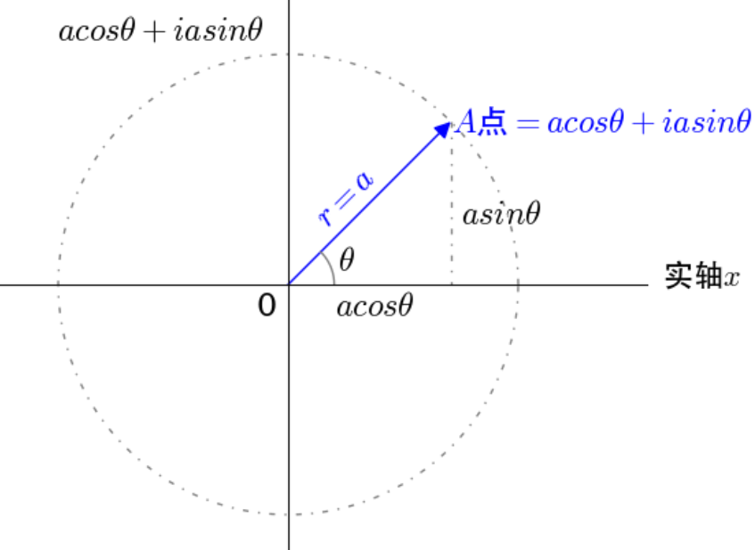
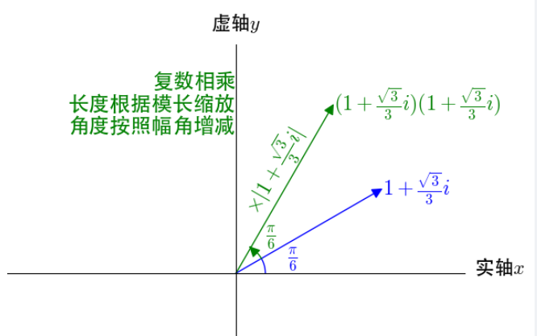
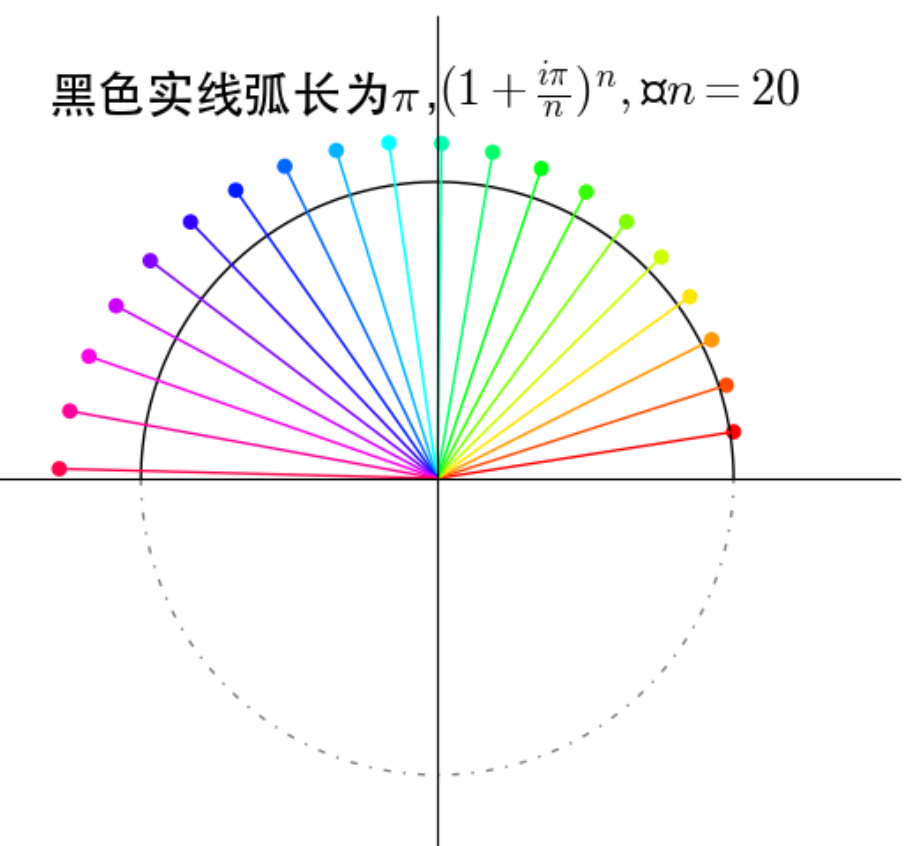
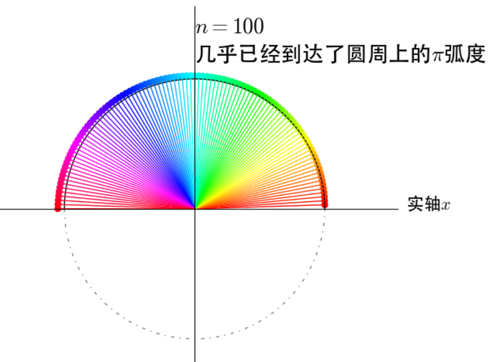
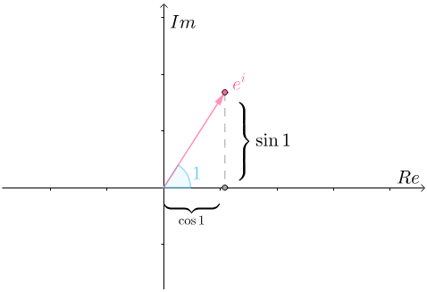
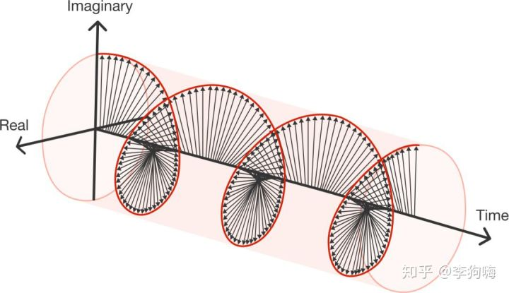
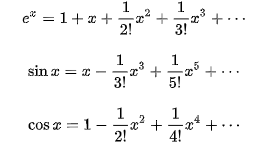
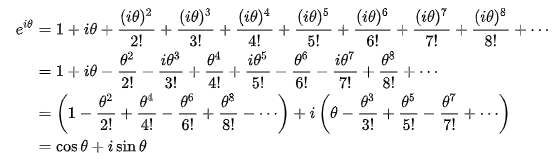

$$
第六版10元瑞士法郎正面的欧拉肖像
$$
[莱昂哈德·欧拉](https://zh.wikipedia.org/wiki/%E8%90%8A%E6%98%82%E5%93%88%E5%BE%B7%C2%B7%E6%AD%90%E6%8B%89)是有史以来最伟大的数学家之一，他在数学的很多领域都有重大贡献。其中就包括被誉为最奇妙的数学公式——[欧拉恒等式](https://zh.wikipedia.org/wiki/%E6%AD%90%E6%8B%89%E6%81%86%E7%AD%89%E5%BC%8F)：
$$
e^{i\pi} + 1 =0
$$

这个公式融合了自然指数$e$，圆周率$\pi$，虚数单位$i$，以及最根本的两个数$0 $和 $1$，没有任何杂质，没有任何冗余，漂亮到了令人敬畏的地步。而欧拉恒等式其实是欧拉公式的特殊形式（当$\theta = \pi$）。[欧拉公式](https://zh.wikipedia.org/wiki/%E6%AC%A7%E6%8B%89%E5%85%AC%E5%BC%8F)是：
$$
e^{\mathbf i \theta} = \cos \theta + \mathbf i \sin \theta
$$
为了理解欧拉公式，当然要理解虚数单位$i$和自然指数$e$。

## 复数

数学上，把$z=a+b\mathbf i$（$a,b$均为实数）的数称为复数，其中$a$称为实部，$b$称为虚部，$i$称为[虚数](https://baike.baidu.com/item/虚数)单位。在复平面上，可以清晰的看到它的图形，其实就是一个向量。

再看$i$的定义，它满足$i^{2}=-1$，即
$$
i = \sqrt {-1}
$$
可以这样看：

- 在坐标系中，$-1$可以看出是方向完全改变，即$-1$是旋转$180^{\circ}$，则$i$可以理解为逆时针旋转$90^{\circ}$

- 复数相当于一个二维正交矩阵。
  $$
  a + bi = \begin{bmatrix} a  & -b \\ b & a  \end{bmatrix}
  $$
  
  - 复数加法等价于矩阵加法
    $$
    \begin{align}
    (a + bi) + (c + di ) &= \begin{bmatrix} a  & -b \\ b & a  \end{bmatrix} + \begin{bmatrix} c  & -d \\ d & c  \end{bmatrix} \\  &= \begin{bmatrix} a+c  & -b-d \\ b+d & a+c  \end{bmatrix} \\&= (a+c) + (b+d) \mathbf i
    \end{align}
    $$
  
  - 复数乘法等级于矩阵乘法
    $$
    \begin{align}
    (a + bi) (c + di ) &= \begin{bmatrix} a  & -b \\ b & a  \end{bmatrix}  \begin{bmatrix} c  & -d \\ d & c  \end{bmatrix} \\  &= \begin{bmatrix} ac-bd  & -ad-bc \\ bc+ad & ac-bd  \end{bmatrix} \\&= (ac-bd) + (bc+ad) \mathbf i
    \end{align}
    $$
  在线性代数中，我们把矩阵乘法理解为一种旋转+缩放，那么复数乘法应该也是一种旋转+缩放。
    
  - 复数乘法，相当于旋转后拉伸
  
    假设
  
    $$
    a + b\mathbf i = r_1 (\cos \theta + \sin \theta \mathbf i) \\ c + d\mathbf i = r_2 (\cos \phi + \sin \phi \mathbf i)
    $$
  
    则
    $$
    \begin{align}
    (a + bi) (c + di )  
     &=r_1r_2  \begin{bmatrix} \cos \theta  & -\sin \theta  \\ sin \theta  & \cos \theta  \end{bmatrix}  \begin{bmatrix} \cos \phi & -sin \phi \\ sin \phi & \cos \phi  \end{bmatrix} \\  &=  r_1r_2  \begin{bmatrix} \cos(\theta+\phi)  & -\sin(\theta+\phi) \\ \sin(\theta+\phi) & \cos(\theta+\phi)  \end{bmatrix} \\&= r_1r_2(\cos(\theta+\phi)+ \sin(\theta+\phi) \mathbf i)
    \end{align}
    $$
    
    

## $e^{\mathbf i \theta}$是圆周运动

再看$e$
$$
e = \lim_{n \to \infty} (1+ \frac 1 n )^n \\
e^{\theta} = \lim_{n \to \infty} (1+ \frac \theta n )^n
$$
上面是实数域的定义，在复数域，可以推广到
$$
e^i = \lim_{n \to \infty} (1+ \frac {\mathbf i} n )^n \\
e^{i\theta} = \lim_{n \to \infty} (1+ \frac {\mathbf i\theta} n )^n
$$
上节中提到，复数相乘可以理解为复平面的旋转后拉伸，所以可以上面公式转化为下面的图形。

当$n$越来越大，图形越来越贴合圆弧了。

由此，可以得出，当$n \to \infty$时，

- $e^{i \pi } $理解为在单位圆上转动了$\pi $弧度。

  很明显，图形移动到了实轴$-1$的位置，这样就得到了$e^{i\pi} + 1 =0$

- $e^i $理解为在单位圆上转动了$1$弧度。

  

- $e^{i \theta } $理解为在单位圆上转动了$\theta $弧度。即
  $$
  e^{\mathbf i \theta} = \cos \theta + \mathbf i \sin \theta
  $$

一句话，欧拉公式体现就是一种复平面的圆周运动。

如果 $\theta $是随时间线性变化的参数，则可以得到以下三维等径螺旋线，该螺旋线在复平面上的投影是一个圆，投影点在圆上的运动为匀速圆周运动。

## 泰勒公式

欧拉公式还可以通过泰勒公式验证。

实数域下，有这些泰勒公式：

扩展到虚数域，令$x=i\theta$：

## 参考

- [如何通俗地解释欧拉公式？](https://www.matongxue.com/madocs/8.html)
- [从矩阵的角度来看待复数](https://zhuanlan.zhihu.com/p/30251453)
- [欧拉公式，复数域的成人礼](https://www.matongxue.com/madocs/2066.html)
- ["上帝公式"(欧拉公式)真的神到无法触碰？](https://zhuanlan.zhihu.com/p/48392958)