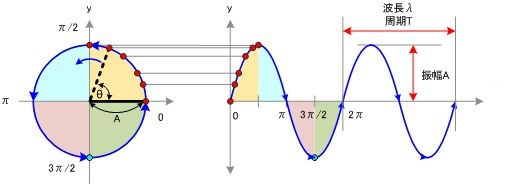

复杂的周期函数可以由一组三角函数线性组合而成。然而，还能再一步简化吗？三角函数又代表了什么？这就要看被誉为最奇妙的数学公式——欧拉公式。

## 欧拉公式

$$
e^{\mathbf i \theta} = \cos \theta+ \mathbf i \sin \theta
$$
在[理解欧拉公式](https://eipi10.cn/mathematics/2020/04/14/euler_formula/)一文中谈到，欧拉公式体现的是一种复平面的圆周运动。

上图中， $\theta $表示时间（右图中X轴），则复平面的圆周运动在时间轴+虚数轴的投影就是$\sin \theta$。如果有多个（周期和振幅不同）圆周运动组合起来，会发生什么呢？见下图。

上面的四行图，对应的函数分别是：
$$
\begin{align}
y &= \frac {4\sin \theta } \pi  \\
y &= \frac {4\sin \theta } \pi + \frac {4\sin {3\theta} } {3\pi} \\
y &= \frac {4\sin \theta } \pi + \frac {4\sin {3\theta} } {3\pi} + \frac {4\sin {5\theta} } {5\pi} \\
y &= \frac {4\sin \theta } \pi + \frac {4\sin {3\theta} } {3\pi} + \frac {4\sin {5\theta} } {5\pi} + \frac {4\sin {7\theta} } {7\pi}
\end{align}
$$
而上面四行对应的复平面上的函数是：
$$
\frac 4 \pi e^{\mathbf i \theta} \\
\frac 4 \pi e^{\mathbf i \theta} + \frac 4 {3\pi} e^{\mathbf i 3\theta} \\
\frac 4 \pi e^{\mathbf i \theta} + \frac 4 {3\pi} e^{\mathbf i 3\theta} + \frac 4 {5\pi} e^{\mathbf i 5\theta} \\
\frac 4 \pi e^{\mathbf i \theta} + \frac 4 {3\pi} e^{\mathbf i 3\theta} + \frac 4 {5\pi} e^{\mathbf i 5\theta} + \frac 4 {7\pi} e^{\mathbf i 7\theta}
$$
可以看到，在复平面组合不同的（周期和振幅不同）圆周运动在时间轴(也称为时域)上投影可以呈现非常丰富的图形。下面是更加牛逼的例子。比如模拟心电图。

甚至可以画恐龙，下面这张图是由50个频率的傅里叶级数组成。更多的动态图可以看[An Interactive Introduction to Fourier Transforms](http://www.jezzamon.com/fourier/index.html)。

通过上面的例子我们可以得出：**复杂的周期函数其本质是复平面上多个匀速圆周运动的组合**。再回顾一下上节得到的公式。
$$
\begin{align}
f(x) =  {A_0}  + \sum_{n=1}^{N} A_n\sin(\frac {2\pi nx} {T} + \phi_n)  \\
\end{align}
$$
如果把$f(x)$看出是复平面在虚数轴的投影，可以轻易的推出$f(x)$在复平面对应的函数。
$$
\mathbf i  {A_0} + \sum_{n=1}^{N} A_n e^{\mathbf i(\frac 1 {T} {2\pi nx}  + \phi_n)}
$$
进一步
$$
\sum_{n=0}^{N} A_n e^{\mathbf i(\frac 1 {T} {2\pi nx}  + \phi_n)}
$$
其中$\phi_0=\frac \pi 2$。这样公式更加简明了，$f(x)$的本质是复平面多个匀速圆周运动（除了$n=0$，它代表静止一个点）的叠加，的确具有更加直观的几何意义了，傅里叶爵士的猜想得到了验证。

> 上面的验证只是直观上的，还缺乏数学上更加严格的验证，但对于我们理解傅里叶级数，是够用的啦。

## 再看傅里叶级数

上一节，我们把 $ f(x) $看成是复平面（多个匀速圆周）组合运动在虚数轴的投影。其实还可以根据欧拉公式，把复平面的运动直接对应到$f(x)$。下面是欧拉公式。
$$
e^{\mathbf i \theta} = \cos \theta+ \mathbf i \sin \theta
$$
可以推出
$$
\sin \theta = \frac {e^{\mathbf i \theta} - e^{-\mathbf i \theta}} {2\mathbf i}  = -\mathbf i\frac {e^{\mathbf i \theta} - e^{-\mathbf i \theta}} {2} \\
\cos \theta = \frac {e^{\mathbf i \theta} + e^{-\mathbf i \theta}} {2 }
$$
进一步，设$\omega= \frac {2\pi} T $，$\omega$指角速度，匀速圆周运动$2\pi$ 角度，刚好是一个$T$。
$$
\sin(\omega nx)  = - \frac {\mathbf i} 2 ({e^{\mathbf i \omega nx} - e^{-\mathbf i \omega nx}} )    \tag 1
$$

$$
\cos(\omega nx) =    \frac 1 2 ({e^{\mathbf i \omega nx} + e^{-\mathbf i \omega nx}} )    \tag 2
$$

> 引入角速度的原因之一是，使得公式看上去清晰一些，否则，公式里符号太小了，几乎看不清楚。还可以有其它的转换。比如：
>
> - 频率：1秒内完成周期性变化的次数，常用$f$表示。单位赫兹
>
> $$
> f = \frac 1 T  \\
> \omega = 2 \pi f
> $$
>
> ​		则公式变为：
> $$
> \sin(\omega nx)  = - \frac {\mathbf i} 2 ({e^{\mathbf i 2\pi f_0 nx} - e^{-\mathbf i 2\pi f_0 nx}} )     \\
> \cos(\omega nx) =    \frac 1 2 ({e^{\mathbf i 2\pi f_0 nx} + e^{-\mathbf i 2\pi f_0 nx}} )
> $$
> ​		$f_0$在公式中代表的是基频，其它频率都是它真的整数倍。

同时更新$f(x), a_n, b_n$如下：
$$
f(x) = \frac {a_0} 2 + \sum_{n=1}^{N} \left( a_n\cos(\omega nx) +  b_n\sin(\omega nx)\right )  \tag 3 
$$

$$
a_n = \frac 2 T \int_{x_0}^{x_0+T} f(x)\cos(\omega nx)  dx \tag 4
$$

$$
b_n = \frac 2 T \int_{x_0}^{x_0+T} f(x)\sin(\omega nx)  dx \tag 5
$$

把公式$(1),(2)$带入等式$(3)$。
$$
\begin{align}
f(x) &=  \frac {a_0} 2 + \sum_{n=1}^{N} \left(
\frac {a_n} {2 } ({e^{\mathbf i \omega nx} + e^{-\mathbf i \omega nx}} )
- \mathbf i \frac {b_n} {2 }  ({e^{\mathbf i \omega nx} - e^{-\mathbf i \omega nx}} )
\right ) \\
f(x) &=  \frac {a_0} 2 + \sum_{n=1}^{N} \left(
\frac {a_n-\mathbf i b_n} 2 e^{\mathbf i \omega nx} +
\frac {a_n+\mathbf i b_n} 2 e^{-\mathbf i \omega nx}
\right )   \tag 6
\end{align}
$$
下面计算$\frac {a_n-\mathbf i b_n} 2$和$ \frac {a_n+\mathbf i b_n} 2$
$$
\begin{align}
\frac {a_n-\mathbf i b_n} 2 &= \frac 1 T \left ( \int_{x_0}^{x_0+T} f(x)\cos(\omega nx)  dx  - \mathbf i \int_{x_0}^{x_0+T} f(x)\sin(\omega nx)  dx \right  ) \\
&= \frac 1 T \int_{x_0}^{x_0+T} f(x) \left ( \cos(-\omega nx) + \mathbf i \sin(-\omega nx)  \right ) dx \\
&= \frac 1 T \int_{x_0}^{x_0+T} f(x) e^{-\mathbf i\omega nx} dx  \tag 7
\end{align}
$$
同理可以计算。
$$
\begin{align}
\frac {a_n+\mathbf i b_n} 2 &= 
&= \frac 1 T \int_{x_0}^{x_0+T} f(x) e^{\mathbf i\omega nx} dx  \tag 8
\end{align}
$$
把公式$(4),(5),(7),(8)$都带入等式$(6)$。
$$
\begin{align}
f(x) =
& \frac 1 T \int_{x_0}^{x_0+T} f(x) dx + \\
&  \frac 1 T  \sum_{n=1}^{N} \int_{x_0}^{x_0+T} f(x) e^{-\mathbf i\omega nx} dx \cdot e^{\mathbf i\omega nx}  + \\
& \frac 1 T  \sum_{n=1}^{N} \int_{x_0}^{x_0+T} f(x) e^{\mathbf i\omega nx} dx \cdot e^{-\mathbf i\omega nx} \\
f(x)= &\frac 1 T  \sum_{n=0}^{0}  \int_{x_0}^{x_0+T} f(x)e^{-\mathbf i\omega nx} dx + \\ &
\frac 1 T  \sum_{n=1}^{N} \int_{x_0}^{x_0+T} f(x) e^{-\mathbf i\omega nx} dx \cdot e^{\mathbf i\omega nx}  + \\&
\frac 1 T  \sum_{n=-1}^{-N} \int_{x_0}^{x_0+T} f(x) e^{-\mathbf i\omega nx} dx \cdot e^{\mathbf i\omega nx}
\\
f(x) =& \frac 1 T  \sum_{n=-N}^{N} \int_{x_0}^{x_0+T} f(x) e^{-\mathbf i\omega nx} dx \cdot e^{\mathbf i\omega nx}
\end{align}
$$
再进行一步简化
$$
f(x) =  \sum_{n=-N}^{N} c_n \cdot e^{\mathbf i\omega nx}
$$
其中$c_n= \frac 1 T \int_{x_0}^{x_0+T} f(x) e^{-\mathbf i\omega nx} dx$，称之为复振幅。可以按照下面的顺序来理解这一概念。

- $e^{\mathbf i\omega nx} $表示复平面某一频率的圆周运动
- $c_n \cdot e^{\mathbf i\omega nx}$
  - $c_n$ 为实数，表现圆周运动进行拉伸，也就是圆周运动的半径
  - $c_n$ 为复数，则$c_n \cdot e^{\mathbf i\omega nx}$是两个复数相乘，表现对圆周进行固定角度的旋转，然后拉伸（还是一个圆周运动，只是初始位置和半径不同）。详见[复数](https://eipi10.cn/mathematics/2020/04/14/euler_formula/#%E5%A4%8D%E6%95%B0)

> 可以很容易发现，上面$f(x)$公式中$c_n \cdot e^{\mathbf i\omega nx} $和$c_{-n} \cdot e^{-\mathbf i\omega nx} $是关于实数轴对称的，这是因为：
>
> - $e^{\mathbf i\omega nx}$和$e^{-\mathbf i\omega nx} $是关于实数轴对称的
>
> - $c_n$ 和 $c_{-n}$ 是关于实数轴对称的（也就是共轭复数），即
>
>   $c_n= \frac 1 T \int_{x_0}^{x_0+T} f(x) e^{-\mathbf i\omega nx} dx$和$c_{-n}= \frac 1 T \int_{x_0}^{x_0+T} f(x) e^{\mathbf i\omega nx} dx$是关于实数轴对称的
>
> 这种对称刚好抵消了虚数轴的值，仅仅保留实数轴的值了。如果把一个复平面匀速圆周运动看成是一个三维等径螺旋线，上面的公式，代表了$N$个对称的三维螺旋线的叠加，叠加的结果是仅仅实数轴的值保留了下来。
>
> 

## 总结

下面总结上面谈到的各种傅里叶级数的公式。一个周期函数可以表示成：

- 实数二维平面（实数轴+时间轴）
  
  - 正弦+余弦函数的组合
    $$
    f(x) = \frac {a_0} 2 + \sum_{n=1}^{N} \left( a_n\cos(\frac {2\pi nx} {T}) +  b_n\sin(\frac {2\pi nx} {T})\right )
    $$
    
    其中:
    $$
  a_n = \frac 2 T \int_{x_0}^{x_0+T} f(x)\cos(\frac {2\pi nx} {T})  dx \\
    b_n = \frac 2 T \int_{x_0}^{x_0+T} f(x)\sin(\frac {2\pi nx} {T})  dx
    $$
  
  - 正弦函数的组合
    $$
    \begin{align}
    f(x) =   \sum_{n=0}^{N} A_n\sin(\frac {2\pi nx} {T} + \phi_n)  \\
    \end{align}
    $$
    其中：
  $$
    A_0=\frac {a_0} 2, \phi_0=\frac \pi 2 \\  A_n = \sqrt {a_n^2 + b_n^2}, \\ {A_n}\sin(\phi_n) =  {a_n} , \ {A_n}\cos(\phi_n) = {b_n}
  $$
  
- 复数三维空间（复平面+时间轴）

  - 匀速圆周运动组合的投影：三维等轴螺旋线的叠加（下面公式）在虚数轴和时间轴的投影
    $$
    \sum_{n=0}^{N} A_n e^{\mathbf i( {\omega nx}  + \phi_n)}
    $$
    其中：
    $$
    A_0=\frac {a_0} 2, \phi_0=\frac \pi 2 \\  A_n = \sqrt {a_n^2 + b_n^2}, \\ {A_n}\sin(\phi_n) =  {a_n} , \ {A_n}\cos(\phi_n) = {b_n} \\
    \omega= \frac {2\pi} T
    $$

  - 匀速圆周运动组合：三维等轴螺旋线的叠加
    $$
    f(x) =  \sum_{n=-N}^{N} c_n \cdot e^{\mathbf i\omega nx}
    $$
    其中：
    $$
    c_n= \frac 1 T \int_{x_0}^{x_0+T} f(x) e^{-\mathbf i\omega nx} dx \\
    \omega= \frac {2\pi} T
    $$
    

> 上面的公式虽然形式不相同，但其共同点是，设定一组基（向量之间两两正交），然后把周期函数，看成是基上的一个向量，这些基，是由各种函数构成的。在欧几里得空间里，向量是实数，在酉空间里，向量扩展到复数，而在希尔伯特空间里，向量被扩展到了函数。在傅里叶级数中，周期函数变成了一个向量，非常简单，而它的核心变化主要体现在基的变化上，不得不再次佩服数学化繁为简的奇妙。

下面列举一下傅里叶级数中的基和周期函数代表的向量。

- 实数二维平面

    - 正弦+余弦函数的组合

        - 基
          $$
          \mathbf P =\begin{bmatrix}
            \frac 1 2 & 
            \cos(\frac {2\pi x} {T}) & \cos(\frac {4\pi x} {T}) & \cdots  & 
            \sin(\frac {2\pi x} {T})  & 
            \sin(\frac {4\pi x} {T}) & \cdots ) 
          \end{bmatrix}
          $$
          
          向量之间两两正交，但并不是正交矩阵（向量的模不为1）
          $$
          \mathbf {P^{T}}  \mathbf P =
          \begin{bmatrix} 
          \frac T 4 & 0 & \cdots & 0 \\
          0 & \frac T 2  & \cdots  &0 \\
          0 & 0 & \ddots   &  \vdots \\
          0    &0 & \cdots & \frac T 2 \\
          \end{bmatrix}
          $$

        - 向量
          $$
          d = \begin{bmatrix}
                a_0 & a_1 & a_2  & \cdots &  a_n & \cdots & b_1 & b_2 & \cdots &  b_n & \cdots
              \end{bmatrix}
          $$
          
        - 线性方程组
          $$
          \mathbf Pd = f(x)
          $$

    - 正弦函数的组合

        - 基
          $$
            P = \begin{bmatrix}
                  1 & 
                  \sin(\frac {2\pi x} {T}+\phi_1)  & 
                  \sin(\frac {4\pi x} {T}+\phi_2) & \cdots & \sin(\frac {2n\pi x} {T}+\phi_n)  & \cdots
                \end{bmatrix}
          $$
            向量之间两两正交，但并不是正交矩阵（向量的模不为1）
          $$
          \mathbf {P^{T}}  \mathbf P =
            \begin{bmatrix} 
            T & 0 & \cdots & 0 \\
            0 & \frac T 2  & \cdots  &0 \\
            0 & 0 & \ddots   &  \vdots \\
            0    &0 & \cdots & \frac T 2 \\
            \end{bmatrix}
          $$
          
        - 向量
          $$
            \begin{bmatrix}
            d =A_0 & A_1 & A_2  & \cdots &  A_n  & \cdots
            \end{bmatrix}
          $$
          
        - 线性方程组
            $$
            \mathbf Pd = f(x)
            $$

- 复数三维空间

  - 匀速圆周运动组合的投影

    - 基
      $$
      \mathbf P = \begin{bmatrix}
      1 & 
        e^{\mathbf i( {\omega x}  + \phi_1)}  & 
        e^{\mathbf i( {\omega 2x}  + \phi_2)} & 
        \cdots & 
        e^{\mathbf i( {\omega nx}  + \phi_n)}) & \cdots
      \end{bmatrix}
      $$
      向量之间两两正交，但并不是正交矩阵（向量的模不为1）
      $$
      \mathbf {P^{T}}  \mathbf P =
      \begin{bmatrix} 
      T & 0 & \cdots & 0 \\
      0 & \frac T 2  & \cdots  &0 \\
      0 & 0 & \ddots   &  \vdots \\
      0    &0 & \cdots & \frac T 2 \\
      \end{bmatrix}
      $$
  
- 向量
      $$
      d =  \begin{bmatrix}
      A_0 & A_1 & A_2  & \cdots &  A_n  & \cdots
      \end{bmatrix}
      $$
      
  
- 匀速圆周运动组合
  
  - 基
      $$
      P = \begin{bmatrix}
      \cdots &
        e^{-\mathbf i {\omega nx}  }
        \cdots & 
        e^{-\mathbf i {\omega 2x} } & 
         e^{-\mathbf i {\omega x}  }  & 
        1 & 
        e^{\mathbf i {\omega x}  }  & 
        e^{\mathbf i {\omega 2x} } & 
        \cdots & 
        e^{\mathbf i {\omega nx}  }& \cdots
      \end{bmatrix}
      $$
      设
      $$
      \mathbf {J} = \begin{bmatrix} 
        0 & 0  & \dots & 0 & 1  \\
        0 & \ddots  & 0 & 1  & 0  \\
        \vdots & 0  & 1  & 0 &  \vdots  \\
        0 & 1   & 0 & \ddots & 0  \\
      1  & 0  & \cdots & 0 & 0  \\
        \end{bmatrix}
      $$
      $\mathbf J $斜对角线为$1$，其它为$0$，称之为[反对角单位矩阵](https://en.wikipedia.org/wiki/Anti-diagonal_matrix) （Anti-diagonal Identity matrix）它的变换是对向量进行上下翻转，它非常像单位矩阵。
      $$
      \mathbf {J}  = \mathbf {J^T}  = \mathbf {J^{-1}}  \\
        \mathbf {J}  \cdot \mathbf {J} = \mathbf {I}
      $$
      则：
      $$
      \mathbf {P^T} \mathbf P =  \frac 1 T J
      $$
  
    > 关于反对角矩阵的特征值，可以参见[反对角矩阵的特征值](https://ccjou.wordpress.com/2016/05/16/%E5%8F%8D%E5%B0%8D%E8%A7%92%E7%9F%A9%E9%99%A3%E7%9A%84%E7%89%B9%E5%BE%B5%E5%80%BC/)
  
  - 向量
      $$
      d = \begin{bmatrix}
         \cdots & c_{-n} & \cdots & c_{-2} &  c_{-1}  &  c_0 & c_1 & c_2  & \cdots &  c_n & \cdots
          \end{bmatrix}
      $$
      
  - 线性方程组
    $$
      \mathbf Pd = f(x)
    $$
    
    $$
    \begin{align}
        d &= \mathbf {(P^{T}P)^{-1}P^{T}}f(x)  \\
        d &= \frac 1 T \mathbf J  \mathbf {P^{T}}f(x)
        \end{align}
    $$
    
    > 从形式上来说，最后方式的数学公式，最为简单优美。

## 参考

- [如何通俗地理解傅立叶变换？](https://www.matongxue.com/madocs/473.html)

- [傅里叶分析之掐死教程](https://zhuanlan.zhihu.com/p/19763358)

- [An Interactive Introduction to Fourier Transforms](http://www.jezzamon.com/fourier/index.html)

- [如何理解傅立叶级数公式？](https://www.matongxue.com/madocs/619.html)

- [如何理解傅里叶变换公式？](https://www.zhihu.com/question/19714540/answer/1119070975)

- [【直观详解】让你永远忘不了的傅里叶变换解析](https://charlesliuyx.github.io/2018/02/18/%E3%80%90%E7%9B%B4%E8%A7%82%E8%AF%A6%E8%A7%A3%E3%80%91%E8%AE%A9%E4%BD%A0%E6%B0%B8%E8%BF%9C%E5%BF%98%E4%B8%8D%E4%BA%86%E7%9A%84%E5%82%85%E9%87%8C%E5%8F%B6%E5%8F%98%E6%8D%A2%E8%A7%A3%E6%9E%90/)

- [频域处理Frequency domain processing：傅里叶变换](https://yangwc.com/2019/10/24/FFT/)

- [傅里叶系列（二）傅里叶变换的推导](https://zhuanlan.zhihu.com/p/41875010)

  

  

