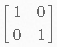
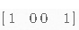

花了一周多，总算把blog系统部署在github pages+jekyll的环境下了，其中碰到了一些小坑，下文将把这些坑和以及填坑技巧分享一下。

### 图片路径的引用

在本地编写Markdown（简称MD）文件的时候，往往会引用很多本地图片。比如，!\[img\]\(images/123.png)，这条语句将会显示（当前目录下）images目录下的123.png图片。当把MD文件放到Jekyll的\_posts目录上，Jekyll会自动把MD文件复制到_site目录下的某个位置（比如：\_site/others/2019/12/07/），然而这一过程中，它并不会去拷贝文件所引用的图片，这将造成网页中图片无法显示。

一般推荐的解决方案是把123.png拷贝到Jekyll根目录下的assets/images目录，然后修改文件中图片引用路径，即语句变成![img\]\(/assets/images/123.png)。

下面是进行这一替换的shell脚本：

~~~shell
md_file=<MD File>
jekyll_image_path=<Jekyll Root Path>/assets/images
# 修改图片的引用路径
sed -i 's/\](images\//\](\/assets\/images\//g'  $md_file

# 把图片拷贝到Jekyll的图片目录
file_folder=$(dirname "$md_file")
file_name=$(basename "$md_file")
cp $file_folder/images/* $jekyll_image_path
~~~

需要指定`MD File`和`Jekyll Root Path`两个参数的值。

> - 据说某些Jekyll plugin可以自动来做上面的动作，大家有兴趣可以找一找。
> - 在windows下，可以安装[git for windows](https://gitforwindows.org/)，然后在git bash中可以执行上面的shell脚本。下文中的所有shell脚本也都是可以在 git bash中执行的。

### 支持Tex/LaTex

默认情况下，Jekyll不能正确显示Tex/LaTex，需要把下面的代码添加到MD文件所使用的[Layout](https://jekyllrb.com/docs/layouts/)中去。

~~~html
<script type="text/x-mathjax-config">
    MathJax.Hub.Config({
      tex2jax: {
        skipTags: ['script', 'noscript', 'style', 'textarea', 'pre'],
        inlineMath: [['$','$']]
      }
    });
</script>
<script src="https://cdn.mathjax.org/mathjax/latest/MathJax.js?config=TeX-AMS-MML_HTMLorMML" type="text/javascript"></script>
~~~

### Display Math换行居中问题

平时最喜欢用的Markdown编辑器是[Typora]()，它的Tex/LaTex语法支持Display Math ，也就是在\$\$中编写数学公式。比如：
```Markdown
公式一:
$$                        
\begin{align*}
y = y(x,t) &= A e^{i\theta} \\
&= A (\cos \theta + i \sin \theta) \\
&= A (\cos(kx - \omega t) + i \sin(kx - \omega t)) 
\end{align*}
$$                        
```
在Typora显示如下:


上图中数学公式居中显示，和`公式一:`分别位于两行。然而相同语句，Jekyll中的显示如下：


上图中，数学公式和`公式一:`都靠左显示，挤在一行，这样的效果非常难看。解决办法也很简单，即把所有的\$\$前后各插入一个空行，这时Typora和Jekyll效果完全相同，新的语句如下：

~~~Markdown
公式一:

$$     

\begin{align*}
y = y(x,t) &= A e^{i\theta} \\
&= A (\cos \theta + i \sin \theta) \\
&= A (\cos(kx - \omega t) + i \sin(kx - \omega t)) 
\end{align*}

$$        

~~~

下面是shell脚本，可以自动执行这个插入动作。

~~~shell
md_file=<MD File>
awk '{
if ($0 ~ /^\s*\$\$\s{0,10}$/)
	print "\n"$0"\n"
else 
  print $0
}' $md_file > temp.md

cat -s temp.md > $md_file
rm -rf temp.md
~~~

### Inline Math对矩阵的显示

Typora的Tex/LaTex语法也支持Inline Math，也就是把数学公式和文本在同一行中显示。比如：$e^{i\pi}+1=0$，其背后的语句是：
~~~markdown
$e^{i\pi}+1=0$
~~~
然而，采用这种方式编写矩阵时，Typora和Jekyll上的效果可能不太一样。比如：

~~~markdown
$\begin{bmatrix} 1 & 0 \\ 0 & 1 \end{bmatrix}\$
~~~

- Typora中显示:
   

- Jekyll中显示: 
  

解决的方法很简单，把一个 \$ 变成两个便可 ，即变成：

~~~markdown
$$\begin{bmatrix} 1 & 0 \\ 0 & 1 \end{bmatrix}$$
~~~

这样就可以在Typora和Jekyll中获得一样的效果。由此，在编写Inline Math的时候，最好直接使用 \$\$ 而不要用 \$ 。

### Tex/LaTex中\{\{被Jekyll当作[Liquid](https://jekyllrb.com/docs/liquid/)

Jekyll把\{\{和\}\}中内容解析成Liquid，如果Tex/LaTex总包含\{\{，会被误识为Liquid，这样会产生Page Build Error。使用下面脚本，在两个\{中插入一个换行符。

~~~shell
md_file=<MD File>
sed -i 's/{\s*{/{ \n {/g' $md_file
~~~

### 支持[Mermaid](https://mermaidjs.github.io/)

Mermaid是一个从文本生成图形的工具。目前它可以生成流程图（Flowchart），序列图（Sequence Diagram），类图（Class  Diagram），状态图（State Diagram），甘特图（Gantt ）和饼图（Pie Chart）。

默认情况下，Jekyll不能正确显示它，需要把下面的代码添加到MD文件所使用的[Layout](https://jekyllrb.com/docs/layouts/)中去。

~~~html
<script src="https://cdnjs.cloudflare.com/ajax/libs/mermaid/8.0.0/mermaid.min.js"></script>
<script>
  var config = {
    startOnLoad:true,
    theme: 'forest',
    flowchart:{
            useMaxWidth:false,
            htmlLabels:true
        }
  };
  mermaid.initialize(config);
  window.mermaid.init(undefined, document.querySelectorAll('.language-mermaid'));
</script>
~~~

然后，下面的代码可以生成美观的状态图了。

~~~
stateDiagram
    [*] --> Still
    Still --> [*]

    Still --> Moving
    Moving --> Still
    Moving --> Crash
    Crash --> [*]
~~~

~~~mermaid
stateDiagram
    [*] --> Still
    Still --> [*]

    Still --> Moving
    Moving --> Still
    Moving --> Crash
    Crash --> [*]
~~~


### 总结

把上面所用的shell脚本汇总起来，可以创建一个执行文件clean_one.sh。

~~~shell
cat << EOF > clean_one.sh
# !/bin/bash
markdown_file=\$1
jekyll_image_path=\$2

file_folder=\$(dirname "\$markdown_file")
file_name=\$(basename "\$markdown_file")

markdown_file_clean=\$file_folder/\$file_name.markdown
cp \$markdown_file  \$markdown_file_clean
# 修改图片的引用路径
sed -i 's/\](images\//\](\/assets\/images\//g'  \$markdown_file_clean

# 把图片拷贝到Jekyll的图片目录
if [ -d /images ]; then
  mkdir -p \$jekyll_image_path
  cp \$file_folder/images/* \$jekyll_image_path
fi

# Tex/LaTex Display Math换行居中
awk '{
if (\$0 ~ /^\s*\\$\\$\s{0,10}\$/)
print "\n"\$0"\n"
else 
  print \$0
}' \$markdown_file_clean > temp.md
cat -s temp.md > \$markdown_file_clean
rm -rf temp.md

# 避免\{\{被Jekyll当作Liquid
sed -i 's/{\s*{/{ \n {/g' \$markdown_file_clean

echo generate \$markdown_file_clean, please check if the file is correct or not
echo if yes, run \"cp \$markdown_file_clean \$markdown_file\" to replace.
  
EOF
~~~

在Jekyll根目录，执行以下语句，进行文件清理。

~~~shell
md_file=<MD File>
./clean_one.sh $md_file assets/images
~~~

上面命令，会在相同目录会生成一个新的文件，文件名是：<原文件名>.markdown。接下来，你可以检查新文件的内容。如果正确， 执行下面命令，进行替换。

~~~shell
mv $md_file.markdown $md_file
~~~


