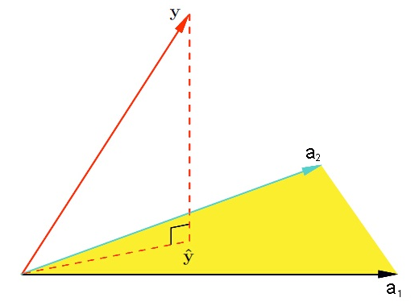

从初中开始，大家就学过方程组，这种方程组也称之为线性方程组。定义如下：
$$
\left\{\begin{matrix}a_{11}x_1+ a_{12}x_2 +  \dots +a_{1n}x_n = y_1\\a_{21}x_1+ a_{22}x_2 +  \dots +a_{2n}x_n = y_2\\\vdots\\a_{m1}x_1+ a_{m2}x_2 + \dots +a_{mn}x_n = y_m\\\end{matrix}\right.
$$

### 线性映射

线性方程组就是一种线性映射。首先做如下变化：
$$
(\mathbf {a_1},\mathbf {a_2},\cdots,\mathbf {a_n}) \cdot 
\begin{bmatrix}
x_1\\
x_2\\
\vdots\\
x_n
\end{bmatrix}
= \mathbf y
$$
其中$$
\mathbf {a_i} = \begin{bmatrix} a_{1i}\\ a_{2i}\\ \vdots\\ a_{mi} \end{bmatrix} ，\mathbf y= \begin{bmatrix} y_1\\ y_2\\ \vdots\\ y_m \end{bmatrix}
$$ ，进一步，可以简化成y：
$$
\mathbf A \cdot \mathbf x = \mathbf y
$$
其中$$\mathbf A = (\mathbf {a_1},\mathbf {a_2},\cdots,\mathbf {a_n}) ，\mathbf x= \begin{bmatrix} x_1\\ x_2\\ \vdots\\ x_n \end{bmatrix} $$

显然，矩阵$$\mathbf A$$ 就是一种线性映射，向量$$\mathbf x$$经过这个线性变化变成向量$$\mathbf y $$。求解线性方程组是已知线性映射和目标向量，求解原向量的过程。

### 方程求解

下面采用几何的方法来求解线性方程式的解。

根据上文的分析，可以认为是$$\mathbf x$$是以$$\mathbf A $$的列向量为坐标轴的坐标，换句话说，$$\mathbf A \cdot \mathbf x$$属于$$\mathbf A $$的向量空间中。而$$\mathbf y$$可能属于这个向量空间，也可能不是，下面详细分析。

- $$\mathbf y \in \mathbf A$$，则$$\mathbf x$$和$$\mathbf y$$维度必然相同，也就是说$$\mathbf A$$是一个方阵。可以得出：

  $$
  \mathbf {x= {A^{-1}} \cdot y}
  $$

  其中$$\mathbf {A^{-1}}$$是称之为[逆矩阵](https://zh.wikipedia.org/wiki/%E9%80%86%E7%9F%A9%E9%98%B5)（inverse matrix），逆矩阵又称**反矩阵**。给定一个$$n$$ 阶方阵$$\mathbf A$$，若存在$$n$$阶方阵$$\mathbf B$$，使得 $$\mathbf A \cdot \mathbf B = \mathbf B \cdot \mathbf A = \mathbf {I_n}$$，其中$$\mathbf {I_n}$$是$$n$$阶矩阵，则称$$\mathbf A$$是可逆的，且$$\mathbf B$$是$$\mathbf A$$的逆矩阵，记为$$\mathbf  {A^{-1}}$$。

  假设
  $$
      \mathbf A = \begin{bmatrix} \mathbf {a_1^T} \\ \mathbf {a_2^T} \\  \vdots \\ a_n^T\end{bmatrix}，

      \mathbf B = \begin{bmatrix} \mathbf {b_1} & \mathbf {b_2} &  \cdots & b_n\end{bmatrix}，
  $$
    则

  $$
\mathbf A \cdot \mathbf B =
      \begin{bmatrix} 
      \mathbf {a_1^Tb_1} & \mathbf {a_1^Tb_2} & \cdots &  \mathbf {a_1^Tb_n} \\ 
      \mathbf {a_2^Tb_1} & \mathbf {a_2^Tb_2} & \cdots &  \mathbf {a_2^Tb_n} \\ 
      \vdots &  \vdots  & \ddots & \vdots \\
      \mathbf {a_n^Tb_1} & \mathbf {a_n^Tb_2} & \cdots &  \mathbf {a_n^Tb_n} \\ 
      \end{bmatrix} = \begin{bmatrix}
      1 & 0 &  \cdots & 0 \\
      0 & 1 &  \cdots & 0 \\
  
    \vdots & \vdots & \ddots & \vdots \\
      0 & 0 &  \cdots & 1 \\
      \end{bmatrix}
  $$

  可以看出，$$\mathbf A$$的行向量和的其逆矩阵的列向量，对角线方向内积为$$1$$，其它内积为$$0$$（相互垂直）。

- $$\mathbf y \not\in \mathbf A$$，则方程的最优解，应该是向量$$\mathbf y$$在$$\mathbf A$$上的最大分量，而这个最大分量就是投影。假设$$\hat {\mathbf y}$$ 是$${\mathbf y}$$ 在$$\mathbf A$$向量空间的投影, $$\mathbf x$$看成$$\hat {\mathbf y}$$在$$\mathbf A$$的坐标.  所以$$ \hat {\mathbf y}  - \mathbf y $$得到的向量应该和$$\mathbf A$$中所有的列向量垂直. 也就是满足如下公式.
$$
\begin{align}
\mathbf {A^T}  (\hat {\mathbf y} - \mathbf y) &= 0  \\
\mathbf {A^T}   (\mathbf {A} \mathbf x - \mathbf y) &= 0  \\ 
\mathbf x &= \mathbf {(A^{T}A)^{-1}A^{T}y}
\end{align}
$$
现在再回头来看，第一种情况下的公式，根据逆矩阵定义：
$$
\mathbf {(A^{T}A)^{-1}A^{T}A} = 1 
$$
两边乘以$$\mathbf {A^{-1}}$$，可得
$$
\mathbf {(A^{T}A)^{-1}A^{T}A  A^{-1} = A^{-1}}
$$
由于$$\mathbf {AA^{-1}}=1$$，可得
$$
\mathbf {(A^{T}A)^{-1}A^{T} = A^{-1}}
$$
这样，两种情况都可以得到同样的公式
$$
\mathbf x = \mathbf {(A^{T}A)^{-1}A^{T}y}
$$
附[代码](https://nbviewer.jupyter.org/github/xuxiangwen/xuxiangwen.github.io/blob/master/_notes/05-ai/50-my-course/machine_learning/c0002.ipynb#求解线性方程组)。

