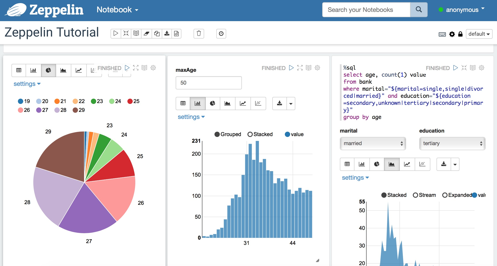
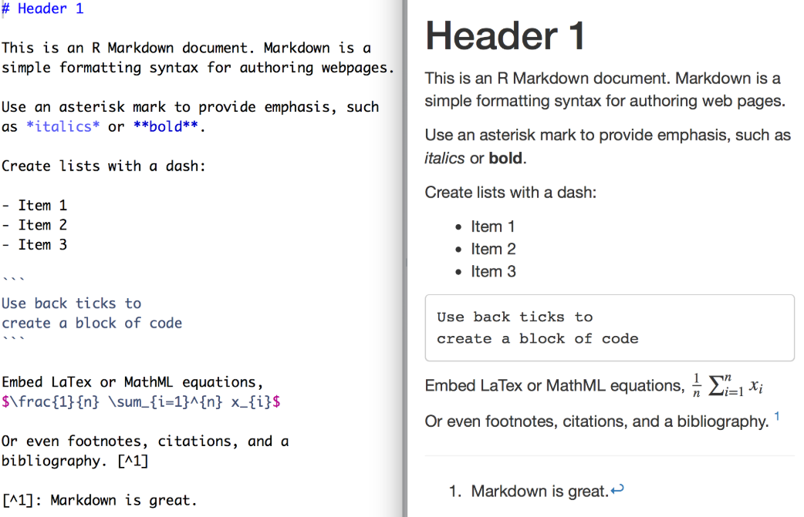

作为一个技术宅，很喜欢学习一些自己感兴趣的技术，在学习的过程中，深感记笔记非常的重要。对于成年人，记忆力比起年轻时候都会有不同程度衰减，由此记笔记尤甚重要。下面介绍一下这方面的心得。

# 笔记

笔记记得好，即使过上几年，再次翻看，还能记忆犹新。

## 笔记种类

从程序员的眼中，根据内容，笔记可以分为：

- 信息。任何你想记录的。比如：服务器地址，账号/密码，知识点等。
- 代码。好的代码易于阅读。代码本身也要求添加的足够的描述。有种说法，代码是最好的文档。
- 文档。个人，项目或者团队的活动中的内容，包括项目需求，设计，开发，测试文档等。文档主要用于公司或团队内部进行知识交流的。
- 交互文档。混合了代码，图表和文档。一般是类似jupyter notebook这种格式，它的特点是交互，体现了在开发过程中，逐步思考的过程。常用于技术学习和数据分析报告。
- 文章。经过自己整理，总结，或者创作出的内容。相对正式，常用wiki，blog等发布。

对于一篇笔记，可以属于多个类别，比如：项目中的文档，可以通过blog单独发布出来，作为一篇文章分享给更多人。相对而言，交互文档会陌生一些，下面介绍一下。

### 交互文档：jupyter notebook， zeppelin

在学习Spark的时候，第一次接触了zeppelin，它是Web笔记形式的交互式数据查询分析工具，可以用scala和sql等语言展示数据，也可以用markdown来编写文档。这种代码，图表和文档混合的方式，真的感觉耳目一新。jupyter notebook也是如此，支持python, r, julia, and scala等40多种语言。下图中可以看到很多图表展示，和报表工具不同，在右上角的区域有可以修改的程序代码。这是一种专属于程序员的文档形式。

---

## 什么是好笔记

再来看看，什么是好的笔记应该有的特性。

- 好理解： 好的笔记是容易理解的，对于要分享的笔记，尤其如此。
- 易于复现： 常说，好的代码容易被测试，对于好的笔记，里面的内容也应该是容易被重现的，尤其是对于交互文档和文章中的内容。所以记笔记中，要记录环境如何安装，数据如何准备，程序如何运行，结果如何验证等。
- 持续更新：好的笔记应该持续的更新出来的。

大家或许都看过廖雪峰老师的网站，写的很好懂。就像下图中所说“中文，免费，零起点，完整示例”。

## 笔记的安全性

既然要分享，笔记的安全性非常重要。不同的笔记也有不同的发布范围。

- Internet：

  - 公开。没有安全性限制，可以发布到internet上，让所有人访问。一般包括一些wiki，blog，开源代码等。
  - 私有。信息是私有的，但可以授权任意的人员来访问。个人的一些文章，代码，但并不想公开的，而且不含有公司的敏感信息。
- 公司：仅在公司内部网络才可以访问。

  - 公司/部门：信息在公司或部门内部是公开的。比如：公司流程，部门policy等。
- 项目：信息在项目组内部是公开的，可以授权项目外的同事来访问。比如：项目开发设计文档，源代码等。
- 私有：信息是私有的，但可以授权公司的同事来访问。比如：个人的一些资料，文档，代码等。

# 工具

任何工具的流行，离不开需求，也离不开合适的环境。

## 历史

个人而言，使用的工具经历了以下的过程。

- 原始社会：文本文件，word，excel文件
- 工业时代：evernote， onenote， 有道云笔记
- 信息时代：zeppelin，jupyter notebook + 思维导图
- 互联时代：  github(pages, wiki) + typora(markdown) + pandoc ...

> 以上的这些时代的划分，纯粹是个人杜撰。

以上这些工具，我们都会混合使用，没有一种工具可以解决所有的问题。

### 原始社会：文本文件，word，excel文件

大家都是使用这些工具开始的，主要缺点是文件分散在计算机的各处，时间长了，放在哪里都忘了，查找起来很不方便。

### 工业时代：evernote， onenote， 有道云笔记

采用这些强大的工具，我们可以编写出如下图一样精美的笔记。

记不得从何时开始，用上了evernote，身边的很多朋友也在用onenote。用上这些工具，笔记集中管理，可以多级导航，搜索起来也很方便，应该说效率大大提高 。后来又开始使用有道云笔记，和evernote比起来，它可以编写markdown，笔记分级方便方便，但全文检索能力又不如evernote。

### 信息时代：zeppelin，jupyter notebook + 思维导图

虽然evernote，onenote等工具很强大，但无法执行程序代码。由此，zeppelin，jupyter notebook等工具孕育而生。

#### 思维导图

思维导图，则另辟蹊径，是表达发散性思维的有效图形思维工具。它运用图文并重的技巧，把各级主题的关系用相互隶属与相关的层级图表现出来，把主题关键词与图像、颜色等建立记忆链接。

### 互联时代：  github(pages, wiki) + typora(markdown) + jupyter notebook + pandoc ...

面临的问题：

- 工具的强大，造成笔记太多，如何使笔记更有价值？
- 学习时记笔记，开发时写文档，需要展示时写ppt，如何用统一的方式来记录和分享呢？

#### 分享

上面两个问题的答案或许是分享。知识的根本目的和价值是分享。

> 当需要分享知识的时候，往往会花上心思，这使得知识更易于理解，更加有价值。

整个知识分享的流程如下：

~~~mermaid
graph LR; 
    CE --> Git((Git));  
    Information--> MDE[Markdown Editor: Typora];   
    Document--> MDE;
    Article--> MDE;    
    ID[Interactive Doc]-->NE[Notebook Editor: Jupyter];
    code --> CE(Code Editor);  
    MDE-->Others[ppt, pdf, word, html];
    NE-->Others;    
    MDE--> Git; 
    NE--> Git;
    Git-->GE["Github Enterprise(pages, wiki)"];
    Git-->GitHub["Github(pages, wiki)"];  
~~~

下面自右向左来详细分析上图中的内容。首先是GitHub Pages和GitHub Wiki。

> 上面的图其实也是用一种代码（[mermaid](https://github.com/knsv/mermaid)）也写成的。

#### [GitHub Pages](https://pages.github.com)

GitHub Pages是一个用来展现GitHub中个人，组织或者项目的静态的网站。它是我们流程中分享的主要平台。

使用GitHub Pages的网站很多，效果很不错，不乏一些大公司，下面是一些例子。

> [Projects using GitHub Pages](https://github.com/showcases/github-pages-examples)
>
> [Open source organizations using GitHub Pages](https://github.com/showcases/open-source-organizations)

#### [GitHub Wiki](https://help.github.com/en/articles/about-wikis)

就wiki本身来说，功能似乎有些弱，但如果定位成分享项目的一些知识，则非常合适。

>  总结起来，GitHub Pages, Wiki的最大优势：流量优势。因为在日常开发中，Github和GitHub Enterprise使用的比例非常的高。

#### [Markdown Editer: Typora](<https://typora.io/>)

非常好的Markdown编辑器。之前用过的Markdown工具不少，包括有道云笔记，visual stuido code，但个人非常喜欢Typora。其中主要的原因有两点 ：

- 在一个界面完成编辑和展现，和word比较类似。大多数其他的工具有两个窗口，一个是markdown编辑窗口，一个是展现窗口，这样无疑就要占用很大屏幕区域。由于我们写笔记时，可能会参照其他的资料，这些资料也会占据一块屏幕区域，Typora这种方式，大大节省了区域的占用。下图中，可以看出有道云笔记的空间实在有些憋屈。

  

  

  

- 添加图片的效率很高。在Typora中可以进行如下设置，当copy图片的时候，自动拷贝到一个指定目录，真的太方便了。很多工具没有注意到这一点，非常遗憾。

#### Markdown

Markdown是一种轻量级标记语言，让写作者专注于写作而不用关注样式，而且可以很容易把Markdown转化成其他的文件格式，比如：html, pdf, word, ppt等等。下面是markdown语言和展现的对应关系，相信大家几分钟就能掌握。

#### Markdown vs. Word

下面把Markdown来比较一下，我们最常用的word。

- 内容与形式分离 vs 所见即所得（内容与形式融合）
  - 专注内容书写：Markdown 胜
  - 调整排版：Markdown 胜
  - 文档发布和阅读：Markdown 胜
- 源码输入 vs 所见即所得
  - 严谨性：Markdown 胜
- 功能：Word 胜
  - 图片支持： Word 略胜
  - 表格支持： Word 胜
  - 显示和上手难度： Word 胜
- 书写流畅性： Markdown 胜

> 自从用上了markdown，再也不看不上word了。

#### Pandoc

Pandoc是一个标记语言转换工具，可实现不同标记语言间的[格式转换](https://pandoc.org/diagram.jpg)，堪称该领域中的“瑞士军刀”。比如：下面的脚本，可以把markdown转化成html格式的ppt。

~~~shell
pandoc -t F -s take_notes_ppt.md \
       -o take_notes_ppt.html \
       -V revealjs-url=https://revealjs.com \
       -V theme=moon
~~~

## 工具的要求

并不是对单一工具的，而是对于所用的工具集来说的。

- 简单易用
- 多种格式： 信息，文档，表格，代码，图表都能支持。
- 编辑方便。不方便的例子有jupyter notebook添加图片麻烦。由于jupyter notebook是web站点，添加图片时不得不手工上传到网站上，然后再在notebook代码中定义，这样就使得记笔记的过程总是被中断。
- 快速检索。不好的例子有有道云笔记的搜索功能。有道云笔记每次搜索时的目录是当前目录，而不是最根层的目录。我的一般工作的场景是，有道云笔记打开，定位到某个笔记本，随时在上面做一些记录，当工作中，发现了某个问题，而且记得笔记本中记录过，这时回到有道云笔记，去搜索一下，这时想搜索的范围一般是所有文档，而不是当前目录或当前文档。
- 易于分享。支持分享到项目，部门，公司或互联网。

## 总结

无论使用任何工具，无论如何记笔记，只要让更多知识得到更好的分享，就能实现知识的更大价值。

## 参考

- [学习编程用什么做笔记比较好？](https://www.zhihu.com/question/21438053)
- [反思Markdown：Markdown的长与短](https://sspai.com/post/37340)
- [关于 Markdown 的一些奇技淫巧](https://mazhuang.org/2017/09/01/markdown-odd-skills)
- [Typora - 不要太棒的Markdown编辑器](https://zhuanlan.zhihu.com/p/44998516)
- [Cmd Markdown 编辑阅读器](https://www.zybuluo.com/mdeditor) : 在线Markdown编辑器。
- [Pandoc](https://pandoc.org)
- [Producing slide shows with pandoc](https://pandoc.org/MANUAL.html#producing-slide-shows-with-pandoc)
- [mermaid live editor](https://mermaidjs.github.io/mermaid-live-editor)
- [GitHub Pages](https://pages.github.com)
- [Creating and Hosting a Personal Site on GitHub](http://jmcglone.com/guides/github-pages)

