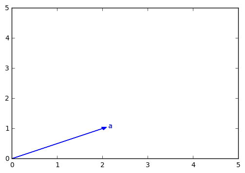
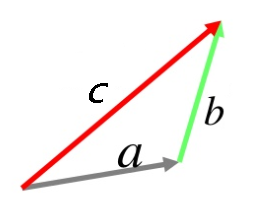
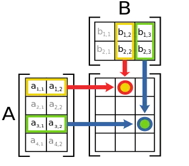
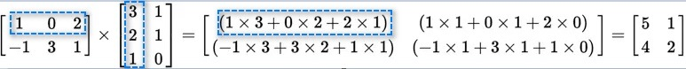
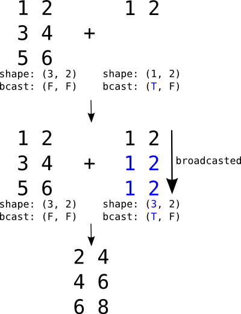
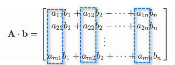

国内教科书中的线性代数（linear algebra），非常严谨，但过于抽象。为了更好的理解，将从两个方面来解释线性代数的各种内容。

- 从几何角度出发，更加形象的解释，重点是机器学习中用到的那些。
- python代码的展现。

在初等数学中，关注的是数，需要求解的是一个或几个变量，而线性代数其运算单元从数变成了向量，求解的变量是向量，或者多个向量（矩阵）。

## 向量

 向量（vector）是线性代数中的基本概念，也是机器学习的基v础数据表示形式。 

$$
\mathbf{a} = \begin{bmatrix}a_1 \\ a_2 \\ \vdots \\ a_n\end{bmatrix}
$$

向量可以看成是$n$维空间中一个点的坐标，比如，下图中，向量$\begin{bmatrix}2 \\ 1\end{bmatrix}$可以表示为a的坐标。

  

图中，很容易看出，向量既有大小（长度）也有方向。

附[代码](https://nbviewer.jupyter.org/github/xuxiangwen/xuxiangwen.github.io/blob/master/_notes/05-ai/50-my-course/machine_learning/c0002.ipynb#创建向量)。

### 向量加法

把向量看成一个点的坐标，很容易得到向量的加法规则。

$$
\mathbf{a} + \mathbf{b} = \mathbf{c}
$$

附[代码](https://nbviewer.jupyter.org/github/xuxiangwen/xuxiangwen.github.io/blob/master/_notes/05-ai/50-my-course/machine_learning/c0002.ipynb#向量加法)。

### 向量大小

 向量的大小也叫向量的模，公式如下。

$$
\| \mathbf{a} \| = 
\sqrt{a_{1}^{2} + a_{2}^{2} + \ldots + a_{n}^{2}}
$$

附[代码](https://nbviewer.jupyter.org/github/xuxiangwen/xuxiangwen.github.io/blob/master/_notes/05-ai/50-my-course/machine_learning/c0002.ipynb#向量大小)。

### 向量转置

向量的默认形式是以一列排列的，称之为**列向量**，如果对列向量进行转置，就变成了**行向量**。

$$
\mathbf{a^T} = \begin{bmatrix}a_1 & a_2 & \ldots  & a_n\end{bmatrix}
$$

$\mathbf {a^T}$表示$\mathbf a$的转置，是一个行向量。

附[代码](https://nbviewer.jupyter.org/github/xuxiangwen/xuxiangwen.github.io/blob/master/_notes/05-ai/50-my-course/machine_learning/c0002.ipynb#向量转置)。

## 矩阵

在数学中，矩阵（[Matrix](https://baike.baidu.com/item/Matrix/3543921)）是一个按照长方阵列排列的复数或实数集合。

矩阵的表示如下：

$$
\mathbf A = 
\begin{bmatrix} 
a_{11} & a_{12} & \cdots & a_{1n} \\d
a_{21} & a_{22} & \cdots & a_{2n}  \\ 
\vdots & \vdots  & \ddots & \vdots \\
a_{m1} & a_{m2} & \cdots & a_{mn} 
\end{bmatrix}
$$

上面的$\mathbf A$为$ m  \times  n$阶矩阵，如果$m=n$，则称之为**方阵**。

矩阵可以看成行向量或者列向量的组合。比如：

$$
\mathbf A = 
\begin{bmatrix} 
a_{11} & a_{12} & \cdots & a_{1n} \\
a_{21} & a_{22} & \cdots & a_{2n}  \\ 
\vdots & \vdots  & \ddots & \vdots \\
a_{m1} & a_{m2} & \cdots & a_{mn} 
\end{bmatrix} =
\begin{bmatrix} 
\mathbf {a_1^T} \\ 
\mathbf {a_2^T} \\ \vdots \\ \mathbf {a_m^T} \end{bmatrix} =
\begin{bmatrix} \mathbf {a_1^{'}} & \mathbf a_2^{'} & \cdots & \mathbf a_p^{'} 
\end{bmatrix}
$$

其中$\mathbf {a_i^T} = \begin{bmatrix} 
a_{i1} & a_{i2} & \cdots & a_{in} \end{bmatrix}，\mathbf {a_j^{'}} = \begin{bmatrix} 
a_{1j} \\  a_{2j} \\ \cdots \\  a_{mj} \end{bmatrix}$

这样的表示方法更加的简洁，而且在做矩阵相关计算和推导时会非常的方便。

### 矩阵加法

假设$\mathbf A$ 是$m\times n$阶矩阵，$\mathbf B$也是$m \times n $阶矩阵，则

$$
\mathbf A + \mathbf B = \begin{bmatrix}c_{11} & c_{12} & \cdots & c_{1n} \\c_{21} & c_{22} & \cdots & c_{2n} \\\vdots & \vdots & \ddots  & \vdots \\ c_{m1} & c_{m2} & \cdots & c_{mn} \\\end{bmatrix}
$$

其中$c_{ij} = a_{ij} + b_{ij} $，也就是两个矩阵中相同位置的数分别相加，其结果也是$m \times n $阶矩阵。

附[代码](https://nbviewer.jupyter.org/github/xuxiangwen/xuxiangwen.github.io/blob/master/_notes/05-ai/50-my-course/machine_learning/c0002.ipynb#矩阵加法)。

### 矩阵乘法

英文称Matmul Product。当$\mathbf A$ 是$m\times n$矩阵，$\mathbf B$是$n\times p$阶矩阵，它们的乘积$\mathbf A \cdot \mathbf B$是一个$m\times p$阶矩阵 。矩阵的乘法仅当第一个矩阵$\mathbf A $的列数和另一个矩阵$\mathbf B$的行数相等时才能进行。矩阵乘法计算规则是：乘积矩阵中的每个元素等于$\mathbf A$的每一行，乘以$\mathbf B$的每一列，然后相加汇总。

公式如下：

$$
\mathbf A \cdot \mathbf B = \begin{bmatrix}
c_{11} & c_{12} & \cdots & c_{1p} \\
c_{21} & c_{22} & \cdots & c_{2p} \\
\vdots & \vdots & \ddots  & \vdots \\ 
c_{m1} & c_{m2} & \cdots & c_{mp} \\
\end{bmatrix}
$$

其中 $ c_{ij}=  \sum_{k=0}^{n} a_{ik}b_{kj} $

示例如下： 

> 由于矩阵乘法的普遍性，一般用 $\mathbf A  \mathbf B$表示  $\mathbf A \cdot \mathbf B$

 附[代码](https://nbviewer.jupyter.org/github/xuxiangwen/xuxiangwen.github.io/blob/master/_notes/05-ai/50-my-course/machine_learning/c0002.ipynb#矩阵乘法)。

**哈达玛积**

还有一种非常普遍，而且简单的矩阵相乘，称之为哈达玛积（Hadamard product）。

假设$\mathbf A$ 是$m\times n$阶矩阵，$\mathbf B$也是$m \times n $阶矩阵，则

$$
\mathbf A \circ  \mathbf B = \begin{bmatrix}
c_{11} & c_{12} & \cdots & c_{1n} \\
c_{21} & c_{22} & \cdots & c_{2n} \\
\vdots & \vdots & \ddots  & \vdots \\ 
c_{m1} & c_{m2} & \cdots & c_{mn} \\
\end{bmatrix}
$$

其中$c_{ij} = a_{ij} b_{ij}$，也就是两个矩阵中相同位置的数分别相乘，其结果也是$m \times n $阶矩阵。

> 在大多数程序框架（numpy， pytorch等）中，都乘法符号`*`来表示哈达玛积，而矩阵乘法反而用其它符号或函数（比如，matmul， dot等）来表示。而这些框架之所以这样定义，或许因为哈达玛积和矩阵加法的机制完全相同（除了一个是乘，一个是加），更加符合大多数人的直觉。

 附[代码](https://nbviewer.jupyter.org/github/xuxiangwen/xuxiangwen.github.io/blob/master/_notes/05-ai/50-my-course/machine_learning/c0002.ipynb#哈达玛积)。

### Broadcasting

矩阵加法和哈达玛积都要求矩阵的行和列的阶数完全相同，但如果不同，能否进行计算呢？答案是可以，但是需要满足一些条件，这种方式叫做Broadcasting。以加法为例。

 如果$\mathbf A$ 是$m\times n$阶矩阵，$\mathbf B$也是$1 \times  n$阶矩阵，可以得到，

$$
\mathbf A + \mathbf B = \begin{bmatrix}
a_{11} + b_{11} & c_{12}+ b_{12}& \cdots & c_{1n} + b_{1n} \\
a_{21} + b_{11} & c_{22}+ b_{12}& \cdots & c_{2n} + b_{1n} \\
\vdots & \vdots & \ddots  & \vdots \\ 
a_{m1} + b_{11} & c_{m2}+ b_{12}& \cdots & c_{mn} + b_{1n} \\
\end{bmatrix}
$$

即下图所示：

同理，假设$\mathbf A$ 是$m\times n$阶矩阵，$\mathbf B$也是$m \times 1 $阶矩阵，则：

$$
\mathbf A + \mathbf B = \begin{bmatrix}
a_{11} + b_{11} & c_{12}+ b_{11}& \cdots & c_{1n} + b_{11} \\
a_{21} + b_{21} & c_{22}+ b_{11}& \cdots & c_{2n} + b_{21} \\
\vdots & \vdots & \ddots  & \vdots \\ 
a_{m1} + b_{m1} & c_{m2}+ b_{m1}& \cdots & c_{mn} + b_{m1} \\
\end{bmatrix}
$$

哈达玛积也可以按照上面所说逻辑，进行Broadcasting。

附[代码](https://nbviewer.jupyter.org/github/xuxiangwen/xuxiangwen.github.io/blob/master/_notes/05-ai/50-my-course/machine_learning/c0002.ipynb#Broadcasting)。

### 矩阵转置

沿着对角线对矩阵进行反转，称之为矩阵转置，转置后的矩阵，记为$\mathbf {A^T}$。假设$\mathbf A$为$ m  \times  n$阶矩阵，$\mathbf {A^T}$是$n \times m$阶矩阵。示例如下。

$$
{
\begin{bmatrix}
1 & 2 & 4 \\
0 & -3 & 5 
\end{bmatrix}
}^{\mathbf T} = 
\begin{bmatrix}
1 & 0  \\
2 & -3  \\
4 & 5
\end{bmatrix}
$$

如果矩阵是个方阵，当$\mathbf {A^T} = \mathbf  {A} $，称之为**对称矩阵**。比如：

$$
{
\begin{bmatrix}
1 & 2 & 4 \\
2 & -3 & 5 \\
4 & 5 & 2 
\end{bmatrix}
}^{\mathbf T} = 
\begin{bmatrix}
1 & 2 & 4 \\
2 & -3 & 5 \\
4 & 5 & 2 
\end{bmatrix}
$$

附[代码](https://nbviewer.jupyter.org/github/xuxiangwen/xuxiangwen.github.io/blob/master/_notes/05-ai/50-my-course/machine_learning/c0002.ipynb#矩阵转置)。

### 矩阵意义

如果说向量代表坐标系中的一个点的坐标，那么矩阵则可以代表什么呢？如果一个矩阵乘以一个列向量（可以看成$n \times 1 $阶矩阵），会发生什么呢？

假设：

$$
\mathbf A = \begin{bmatrix} a_{11} & a_{12} & \cdots & a_{1n} \\a_{21} & a_{22} & \cdots & a_{2n}  \\ \vdots & \vdots  & \vdots & \vdots \\a_{m1} & a_{m2} & \cdots & a_{mn}  \\\end{bmatrix} = 
\begin{bmatrix} \mathbf {a_1^{'}} & \mathbf a_2^{'} & \cdots & \mathbf {a_p^{'} }
\end{bmatrix}，
\mathbf b = \begin{bmatrix} b_{1}  \\b_{2}  \\ \vdots \\b_{n}
\end{bmatrix} 
\\
$$

根据矩阵乘法可得：

$$
\mathbf A \cdot \mathbf b =
\begin{bmatrix} 
a_{11}b_1 + a_{12}b_2 + \cdots + a_{1n}b_n \\
a_{21}b_1 + a_{22}b_2 + \cdots + a_{2n}b_n \\
\vdots \\
a_{m1}b_1 + a_{m2}b_2 + \cdots + a_{mn}b_n \\
\end{bmatrix}
$$

公式右边，一列一列的看，可以找到规律：

推导出：

$$
\begin{align}
\mathbf A \cdot \mathbf b &= 
\begin{bmatrix} 
a_{11} \\  a_{21} \\ \cdots \\  a_{m1} \end{bmatrix} b_1 + 
\begin{bmatrix} 
a_{12} \\  a_{22} \\ \cdots \\  a_{m2} \end{bmatrix} b_2 + 
\cdots + 
\begin{bmatrix} 
a_{1n} \\  a_{2n} \\ \cdots \\  a_{mn} \end{bmatrix} b_n  
\\
\mathbf A \cdot \mathbf b &= 
\mathbf {a_1^{'}} \cdot  {b_1} + 
\mathbf {a_2^{'}} \cdot {b_2} + 
\cdots + 
\mathbf {a_n^{'}} \cdot  {b_n}

\end{align}
$$

公式右边，可以想象一个以$\mathbf {a_1^{'}},  \mathbf a_2^{'},  \cdots,  \mathbf {a_p^{'}}$为坐标轴的坐标系，则$ b_1, b_2, \cdots,  b_n$可以看成是这个坐标系中的一点的坐标，即基于这个坐标系的向量。

由此，矩阵意义在于可以表达一个坐标系，和标准的坐标系不同，它的坐标轴是矩阵中的列向量。在线性代数中，把这样的坐标系，称之为**向量空间**，也叫线性空间。而坐标轴矩阵中的列向量称之为**基**。向量空间中其他任何向量，都可以由基中的向量线性组合得到。

矩阵和向量乘法的意义在于，把矩阵坐标系（向量空间）中的一个向量，转化成标准坐标系（向量空间）的一个向量。

> 在二维平面，默认选择$\begin{bmatrix} 1 \\ 0\end{bmatrix}$和$\begin{bmatrix} 0 \\ 1\end{bmatrix}$为单位向量，这样二维平面上坐标和向量就是直接对应，非常方便。实际上任意两个线性无关（二维空间可以看成不在一条直线上）的向量都可以成为一组基，而且除以向量的模都可以使模变为1。 严谨的描述，参考维基百科[向量空间](https://zh.wikipedia.org/wiki/%E5%90%91%E9%87%8F%E7%A9%BA%E9%97%B4)，[基](https://zh.wikipedia.org/wiki/%E5%9F%BA_(%E7%B7%9A%E6%80%A7%E4%BB%A3%E6%95%B8))。

### 单位矩阵

单位矩阵是指是$n \times n$阶矩阵， 其主对角线元素为$1$，其余元素为$0$ ，记为$\mathbf {I_n}$。

$$
\mathbf {I_n} = 
\begin{bmatrix}
1 & 0 &  \cdots & 0 \\
0 & 1 &  \cdots & 0 \\

\vdots & \vdots & \ddots & \vdots \\
0 & 0 &  \cdots & 1 \\
\end{bmatrix}
$$

如果说矩阵是一个以列向量为轴的坐标系，则单位矩阵是标准坐标系。单位矩阵就像初等数学里的$1$一样，和任何向量相乘，都不改变原向量的大小和方向。

## 参考

- [什么是矩阵](https://www.jianshu.com/p/f9826690133c)
- [矩阵乘法](https://zh.wikipedia.org/wiki/%E7%9F%A9%E9%99%A3%E4%B9%98%E6%B3%95)
- [矩阵乘法的本质是什么？](https://www.zhihu.com/question/21351965/answer/176777987 )

