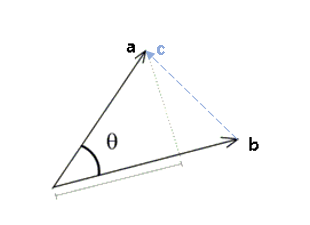
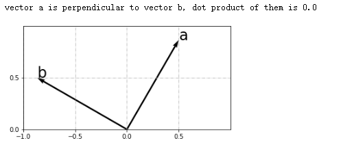

向量内积也称向量点积（Dot Product） ，是两个向量各个分量分别相乘，然后全部相加而得。

$$
\mathbf{a}\cdot \mathbf{b} = \begin{bmatrix} a_1 \\ a_2 \\ \ldots \\ a_n\end{bmatrix} \cdot \begin{bmatrix} b_1 \\ b_2 \\ \ldots \\ b_n \end{bmatrix} = a_{1}b_{1} + a_{2}b_{2} + \ldots + a_{n}b_{n} = \sum a_ib_i
$$

附[代码](https://nbviewer.jupyter.org/github/xuxiangwen/xuxiangwen.github.io/blob/master/_notes/05-ai/50-my-course/machine_learning/c0002.ipynb#向量内积)。

向量内积的等价表达形式是：

$$
\mathbf{a}\cdot \mathbf{b} = \mathbf a^{\mathbf T} \cdot \mathbf b
$$

一个列向量，可以看成$1 \times n$阶矩阵，一个行向量可以看成$n \times 1$阶矩阵。上面公式右边的表达形式，能够使得向量内积和矩阵乘法用统一的表达方式表达。

### 夹角余弦

进一步推导，还可以得到以下公式

$$
\mathbf{a}\cdot \mathbf{b} = \|\mathbf a \| \|\mathbf b\| \cos \theta
$$

其中$\theta$表示两个向量之间的夹角。

下面来推导上面公式。首先，把向量$\mathbf a, \mathbf b$看成是两条边,  则第三边为 $\mathbf c=\mathbf a- \mathbf b $，根据[余弦定理](https://baike.baidu.com/item/%E4%BD%99%E5%BC%A6%E5%AE%9A%E7%90%86)，有：

$$
\begin{aligned}
\| \mathbf c\|^2 &= \| \mathbf a\|^2 + \| \mathbf b\|^2 - 2\| \mathbf a\|\|\mathbf  b\|cos\theta \\
\| \mathbf a\|\| \mathbf b\|cos\theta &= \frac {\| \mathbf a\|^2 + \| \mathbf b\|^2 - \| \mathbf c\|^2  } 2 \\
\| \mathbf a\|\| \mathbf b\|cos\theta &= \frac{\sum a_i^2 + \sum b_i^2 - \sum (a_i-b_i)^2}{2} \\
\| \mathbf a\|\| \mathbf b\|cos\theta &= \sum a_ib_i = \mathbf a \cdot \mathbf  b \\
\mathbf{a}\cdot \mathbf{b} &= \|\mathbf a \| \|\mathbf b\| \cos \theta
\end{aligned}
$$

如果两个向量是垂直的，即夹角是$90^\circ $，则其内积为$0$。

附[代码](https://nbviewer.jupyter.org/github/xuxiangwen/xuxiangwen.github.io/blob/master/_notes/05-ai/50-my-course/machine_learning/c0002.ipynb#两个垂直向量的内积)。

### 单位向量

 指大小等于1的向量。可以用$\frac {\mathbf b} {\|\mathbf b\|}$表示单位向量。

这样公式可以变成：

$$
\mathbf{a}\cdot \frac {\mathbf b} {\|\mathbf b\|} = \|\mathbf a \| \cos \theta
$$

### 几何意义

如下图所示，$\|\mathbf a \| \cos \theta$是向量$\mathbf a$在向量$\mathbf b$上投影的长度。

 ![Image result for 单位向量 投影](data:image/png;base64,iVBORw0KGgoAAAANSUhEUgAAAScAAACrCAMAAAATgapkAAAA/1BMVEX////7+/sAAADu7u78/Pzv7+/x8fH29vby8vL09PT19fX6+vro6Ojr6+vm5uacw+VCQkLd3d3a2to+PDp1k61QZnijzPCVv+PHx8dWVlY+Pj5NlNKMjIzs8/rExMS1tbV8fHyx0Otup9pwcHBiYmKjo6MlJSVQUFA4RlLU5fQ0NDQUFBTR0dGkyOdqamqtra1tiKCbm5uDg4MeHh7j7fdhn9dTl9PJ2umsy+YuLi4mMDgqN0JKXm+DpMBCU2EUGR1YboFkfpSMtd7E2/Bve4Y5YocsS2caLkBKgrV6qdZmotjY4euzx9tCPDZKZH1cZm9Te58QDAZ7mrUnMTocJCrRfMaCAAAWDklEQVR4nO1diVvjOLK3LVmHZTkEuidALsLRdOgAAw2Bnpm+YHffNP12385u//9/y9PhQ75iJyQhaRDfVy5FLrnyQ1apdFQsC1kyAUURkxQblBm85eubTAGDZ66k0FOUGjwpEdafK6mqukPFbEmpwXu1FFMZGyueJrxNawiHxYXqvOCU8C84TYmTqS3R2NgJNiYfiqQEDN5W1UOlQoiTwZcKI2tiseZDnKDCRqnEYG3FGEmUsb3aiqX+gZYbuACAiPri4vo8R31V3DRvzVEuLy5XVSgeKB5ofrJwVd2BoUyQVa9K2M8qllKylmJgJdsTyt369O1pFfunm3uRul5esZd+3CjuPozbIo0HLzhNxGnYvrvvDhvjcXelcJpb/8Tm1D/BK/XRfnuQ3Jrvn/CS+yfiE4QQCRT1ubgQDhTN8og2qbrJFDB4IC/EVWKun6EVwmYxoYHneeyufUvjWwOQKONn+SrFuFIMKMWAnygJ6ihGVDFawfYk+PvB7e3+eKXa0+r1T9ZpW/XjGqeV6Z9WDqdB+3pwZVl37RecJuEEv2mAVg2nlRuP77fvpVRF//Ts/TvUau/f+Pf74/EpevHvJrQn9iC78etG+3aV2tPK9U8i3Q8G97B7epVT7KUfTxVrSvOKveC0jvOZ2Oyf8jhNMR43MEsJl+JUaz6zDKfJipnYwDxOVf0TBNC2bcgVBVRQm2JJiZfwVPEw0DeZAglvY3VhRPIMwYS6sERYVcrt6rohSJSBSFAo+nFGISS4hmJUZbD6bhglSmq+QlgX29G4IDSOvrSBPlfWNMdXWND8WKB8XAAyfPW8b6wM4ohS1OscfPgbddUnVYr5oTKmkqBEsScZF1hzXkfQL1zvfO/EEWlvwMK377mOCwr6cdUzbfbOz947YTrotoYv9i7mdbG/Obo4PHnnJOkYD1uDp8KJTIuTab5CnPL27lE4IRRsdw53nUza8q1BowXr/QPr27tynKALZeKKup6kHpOUYsXjhLcCS91kChg8BpJKKyQoyvKlwkqquNjj/c7hSRYilTjrNhqtYT3FXEMZUlsxzUNfFVuYY8/zsK8od8UFA+RF1HM170oeB/omUyDhPaQuFEhKeMJTfVOpsFdWt31WCJFMmza6aTUaA61khWKuuhClDOIJTyoUw0ndXqW9W8g4s9SspIubZTCNxNNuGyKhF3sn+U4xTD1R2pUwtW5gHcV+entH3xXBdC5Lhy0J1K1dLjxnnFIeV33/rsDelb13ZKJwwXuXFJ8XwNRRpYOGSt3aik1h70y+0L9zqbhI6yYowQlPvWpPSNo7QYVBkRQZfJl/5+bcqGzd0HqTg+kSM1HQ1TC1hjUU87Ri6rthlPBsGv+O+lSmQFEfSApcSXmOp019kylg8K66IK6on+UrhEuKYS8L06HFhUreTUsDdVujbmAo43JDMV5fsZW2d8JTOc7AtBPO+4avXfjiPWt7R60gN4A6xnqezg6bk3jxaij2c9u7ID8qOOGWxmkY4dQYLAunFbV39nm+C38XyFLp+8avnX7xlmHv8v4dNXy60L9Tn4uuf0r/jiR8hXC62LK2447pIGlWI1UqDDGOm5O0eFV1e4ZiOOd41lNM+ncy+YoK/04kl0gKkOJRwgtXR91kChg8Uhfh00nKs3yFsFnMwOZhBM1GzyLRZME2peoexG4SnBq3rFIxlSFKGWIoRqZQbBXtHTuIUPqrLz8Jxwb9ZJ3TeO0aDTaNYj+RvTuK37OL8NYdmTmK16VsbMIkLd6zs3fY6sXzTXsgulXOG0hvJcQJDlsmULc/i72bonlv78QDyk2c1H3gXCo1wvfu/lSlRkNf4NL9u/mt37l6Fc+eYv0OWnwvHij1bSu5FQY70iGz9Wodwt0u7QIybA0w71LaZVOt3ylKEr6mf+f5nnBfvEDR0L9DyqdzE/8OqM+9pr7JFEh44d95GdeJaOqXCdOYimLmJgOAI8Q881bMtUohFR95IU7Iq1YMqAwCWc9O00iYFgvr4tXx72g/HldeBrniwn2sw+7z29czilE6DFK7VlZmH8Yq4NSMHd7j7cK6C3HqwueEE7JAJ5re/XBuF9ddgBPstu6fal+PVsHc0lexv4AafNn+AqusGwg3gp1/iNzcjn5+0f4Cc2+93ndoyfXgafYXqLqh2T95hjAtEba4vvhNX6aQBpIGJdTfNG/N0aBpCIQfGXyhMOe9jbhj2ia8rG5TsZD3b1q3fEbFgkrFYhoWp4Gs1Z5SAtO2p4xwMhO3O5pUd0F7gnIfRqo9lQlP3Z5MPmpPT9g/MRKPK9/36cS6n7O9Yxfx/NsFq9rXMxknfavZeg2nZ81x6sV7UPb8yrqLcGKDqwinsrQoe7esc2XIGsUzccebNeouGo8rezcZpzmOx5/gnCJhm3HH9OHcxzXqLjiniIS9kwuOEjNKYRYi/BOcU4w7Jjn5hqxscc32dBW2J/dg76ijxvG5tNb+XT9GqcOy6kzVjw+x7J+w0xfZwLELcFrfftwexd33mRoxPfo8gu+oepxmDqU1xikwHV49zJsdp66t7J2oIBj1I5xGJl4rae+qz5W5nb9MhzeyfTXqLjpXdiX8YKkYPDrbO9+McNreNHCaY/+08HOKIY8C9yieYzoIPPTYODRA2DskDDTbPZZfJdue6LqeU0zGlWcBM4RnbU9WOH66cNSnhe/d+tm7ZryQcjyquQ+jqn/qnsrzCHDn2NI4afd9Yf3T4nGixkLK+14i8EicJBX9eMeRTM/hR8F642Txo+hQyvsLbgjMByeys7Pd3zs/OVCjsTWwd2XjcWOF1y+YNpx5PC79YGXvmqNNYIERtWDQDPq9oNmMvL618e8oNhzebUbrxKGp6d+5iX8XJbitU89bL/9OXOKO6c15ifDM7Wm58wWL7J9sY4W3QOBx/ZMaZy5x/mlxOPXjM4Udb4p9PbX78Ss7wknPXrIcXX2csLWdLKQExcLzsXc1FFste2eOx63NeE/ccQ9PFJ7Zv5PtaXn7Cxbg37k02dIsRkxkQXFGv7cGaL3j0JynOqYFxa21DHu3hvtVLGs7nhY4Ux3TguKGwCc8Rz0HnJITKTujMH7BYnAy16XWDic/2TnYm2r/0zrauxnj0Ngeu4g6pncXUpPHn5cq7J/KcJrsKDwyDo0d7iZVuzXL9rESamzpTAkkvMX68UzcQRNDYx/rZGG7um7IlTLRPlatWPd2CBGuFrapykzex1oqnIlD89hxAcLJuPJ4hN3Fxx8P533XbFwA4nHlm17yrs05Dk3BuGCtzuV7LB5XvjtiiQoL7cdNP3hN7N1RtHPQ6SCzDS3Y3j3dPtaZ4tCM4hGTdHjnHYcmj1OpvauD0zLi0BSc6EPGCu9JX9Q2/TlFUHBOMccDrQYLzylqftgtVyx1TnFiHJqqc4p+fE4xG4fGRToaTYbPR2zBMLiMO6ZzHdxl+jg0RriXsmLsazWI+lzzVPjBrESxNG/EocFPE4cmCVfRsYvWORczzszP+9afkF66vRO19OLu+0CKLzl+5pr4wTRZ4d3paXWWi9Oy/WCzo6/v3yUO71Y/XJRbRByaDE51/Lu88CLOKerYM5InXsJn4tBYLF7hdS6oFcWhCc8pGhFGyeQ4o5VxaBJeh8NhtoozGgXIgTpYTq04NMK/U9RQbKo4o1PEoQmP7HHWNzboQK9eHJpQuCzcS0Wx7xrnFEP+qnGDNV8hbMahKTunOCEOzaznFEfGGV7bEF5EHJr52Lun8O/8eFz5Ybti/e4Z2zuaLKQc5dRZMk5Pcv6ulr0L+onD28wJL8Hepf27rB+8WHtXNw5NyuHdtLRbJr9kJg6N4dPNHIemnn9nRfwKxaFhsBlv0NntWSwUAMFFh7M5x6EpKPa1GioODSBaSXpzVTNAztLi0DALio7p739XMB0ZAv096/wNRpPfuwXZu6vV8++YjA3zj+vr8f84F+bRtv6xYJxmiNOzt3fhzsF//DlufzcFmu9HMkjMJnkOOFWs30FjS/POt3HLFDg8YGqn7ZLfu5CH992VWb+DLJmJ+9APrsbtYRQ+Bloj0ZKgdblLozg0arVOL42l4tA8ev3OLlq/E+6djbwawuH6nbFmN8P6XVkcGk+6TowkOwcvkB2wVvsORwLw4BgEgDkdW0dsQTrcC08o0dSfGCsmikMzKZSMZ/h3nvbyAPKIVnLKODRmsJwaQWxqxaHpxQ7vHlBN8Kp9zWIB5/By7/LM2Xwi/06dy396/45Zo3iFd6cZiTy072koMHKQuKmz+8z9uyQ2zMY2i8N837Zb0e8fH72XOsso188YJxrHhnlzZG6DHI73o6MXl3vi1r5jPRVO3cZTx6GxbMPhBZY5r8LG4+9hXWdiYB7IyZWCfaxTxKFBVklxqn8qiBsi9z4/ZRwa7veTPXE9wFNxaMB++3+5uhVcdig42HMfFYcmG+5lijg0gc/5rAFy5hKHhpszcTC7X6XVPg0F3N3zS9PXmyUOTbY95Yvz9i5uT2Kc+XRxaHA8rnwvz7vn5jMH7btYwE+HMVnbfvyoz1LfpLIfx/Qo/uWGjqolh5PoyMvUWVucjp13Z300BU7GzkFuF8+PX40fusU1Lhunq7nhpBzYN2c9nuoKSu1dMhO3MyrdT9e9vu4mX69smudxv2+erhsO7rvAsHfzjwsZOfofDnSrKhqPR4fyDIf3zTnBpOScIuEP4++09jnFwjg0U55TdE9brdubK0TT5xQBoUTzVYccq84p2saPMLzb63OP09JzisiI0hzaquL2ZO2Ph0tuT6cyKnTrdtjVWsTtCdbcsF27PUW+bL+gPWk9+3H3vYdTfVJ+nXO/rXBaXv8Eb8MA2q3TG/nKR/NP81uXyuAku+eeHfZVJk6Jw3sQfVqY1PO+aZy0gnr4ovnoohLM8SgnkBKeUHybxBpvnN53vbBaae+sSuGsYmaKFMvj5Dh/nfXN90AG2DhMSnePN7a2tnY3NnbFZWNjQ9Nd9dHG1onI/PPP63/9U2ROovLUzXFmV8nsqgoU3d2Nbtgyq97aOtEPODGedrIVPU0+Z+NjKix74/TV/8nqtr788lGpJUUm0uhSwu9uFP6KlbKAIBlnskPn0+vXvznOf1+//iRKP73+44fj/Pb69ds487vKvBOZz47z5/W/ZeYPlRElvzvO52xGSL6NMp/izI8481ucEY/WTwszv2UeLTMpnBRWH7/+Vzyu9aX4+80xfTjohXFt0OaHt7/88stHx/koLm+dTzpzpzKvBf2P4zTE5Tfni6C/On89jO9+ccLMj5a4fHa+CvrV+SFua/1wfhWZL85nQVvvnFfi8tr5IWjDcf6jSuTTWvppn6Kn6UcX6SEe0GhlcWqIJ338tHCQdHp/Ic88iPa04fz66pVoAn+8evXrZ+ezyHxSma+fnR8iI/63X0RGtDed+de/Zeb3V69e/a5KvmQyb0VG/Le/Rplf48wnkfnhfP6qniYz79QD9NNE5nOsx9eUHrn2JFD68mM5KL05igK6UV78C5irk9I4tVoSzKWkDRmy5enjsdYcF9inZi8+GCI1uzrP83dF9s457nCj7qjG0nXzhcTPnH6cGYHEjHFmbcWmHGeKtHMRhLMuE9Y5l4tTyt0sam4ap9bpYNhN+3eLwum4EyTCWf9uiXFGU8IsNRY0h4eJfyda0u2NL3dmpvy7iJ+nf+fsXow84JGViDOaEi5NSXsaDH3dehbdnk4umlnh2fYd5gQMfsZ+vDTFt8LC+ae59+PSuk2Yf1p9nKxF43QsO25QLLxaOOFRbzuw0ml5OF1e+KkAPzX39SwszmihsEy9w/5m7/DISqXJ+wvYHPunScIRTguPM1px3lx+0UD9EnfTkQM7oJqVpFVxaGL66PPm7irFGZ3QnvwT6ZT7jqSB8s/9zVVrT6vRP1mwd7SXwWl5/dMk4ZXCKTg8PgqCF5wqcGqqX0tccZwq9rHmcZpiPF5nP51IBx+sApwq9rEuPw4NY8zmigIqLnKLqKDEU7yiRH4uf7ZQ3WQKGLwnL3LvqqDYTXjmThKWX31jR+PUDEyczFu5VkMphnCiJPJqKEaBUomc3l1BrNUjiqJqYWarYibHBTKF1JdUGNtCiprIuDVHubpwP+GB4kEwQViNCzpyRMA6TtAxcUrdWqJSLcX8ULGH9g3KK1kh7OrilRgXwMs3nb2D7cOTi/rjghn8YLnyuO7jgjgtsB+XOK21vTPTgnHS7Wk1fz+YTBTOJK78Ft5M31orDk2VYhKn7ver7gR7lxeOcKp3TrHOcUBsHAesf06xCCudKs8pwrrnFHUcGiJwGly329enbMlxaNI8UqFpVOwZrGLPmHypcDlQRXFocBKHhtRWTMWhwQTsj/fb+61v4/YpVootLw7NnMaZxanC3k0/Ib0/Hg8sZt2Or6/W394laQH9+ED2SfC6fa/E1svela63LGxc8G3cmgGnp7Z3Fet3KZwm+3dlwqa9k9jcje/sHE6V9i4dhyY+pwiNOKOQGscBSyO2FMShQXXi0NjVdUNgKEO0SgmvhMWfW6IY1XFohL27kefyBU4trM8pyoA24ZOFjZs6Do0R7qUgDk1ZxBa3LNzLnOPQAJDwxjlF19PnK4NcRToODXGFf4eFSuyhferG6nmuPqfICUVCWHwqqtJiSmr2ODRztncps1JWbL53iKjXQL01oWLCjSaQufITO8grpncK0IfrllTv6vpB74iFFMrNqHq7BWdMBSmQHViAsJwgEIQTvCr9+NT77DEh4uv5FDGMxOdU9OuAibuJRxGWOGFxwR4S8ADFU18IEkKvh63T79+H4/t7ItsHEZIAeiywPPE1ARP3E9GGiGULZwAwiiwxyrKs6PeF1g4nyi2GoS8e54tniicRSwypiYUwF88SOMkLBlIfALmFsUuFW0EhGd/fPpy2x+37QJSLduMBG1kINm0EicSJuULEJvIcEEHy/aA2s2CE01Pbu4L3rtTeKcUQEm+SwAnJvQcAyvbkW9TGDFM5uRfIZ7vUk0C76uUkPoPUtry7G9y9+XY3EK2ECveBAi68H2wFlElIBfGsECf5K0Os6UmOhfszU1bCpVFIsww1466lBAweSzMBlb2DytJFvFstXFV3FHdNUgRE9YwLa0Usz2fiRg9BYLkSJ8ZZk8kL8Sybi05HtBpKkO17DHpU3EAF7hjZorfGkHDmCQcRCbiA8JKweJG51FboYkEbif+CaCWkqe1dOgALysahQSjhq8K9LCkODfeZ+IaBCwgHTY4BD3DTlcFwOAeBsH1MbuTh4s9nm8K+BRQEPhBOXsARYOJmn3KPc+zygMssCwLGAQsQUVnqMxpw7hPe5L6o3J8mDs1K2btkndMtV0zcKloPMhSz13ydc9ZzZbZ8SLnfQuWc9s+0fjc7TtazWr+b/r37Kdbv8JTrd+EyWUXd+fU7Mv36naHe9Ot3mTg04uJFcWg0ryiojtjiuX4Se2aKODRmuJcJcWi8KAJNSA0lq4SjODTZMDnTxaHRLTekqmHrqVg9dW3S0p+Z0xSGF91MDcpqCFcUm4rZ5mNmVMzkayn2/4FhNd6/xTeNAAAAAElFTkSuQmCC) 

把上节公式左右调换：

$$
\|\mathbf a \| \cos \theta = \mathbf{a}\cdot \frac {\mathbf b} {\|\mathbf b\|}
$$

可以得出：**向量的投影等于该向量和（被投影）单位向量的内积。**

如果把$ \|\mathbf a \|$移动到等号右边，可以得出，**夹角余弦等于单位向量的内积**。

$$
\cos \theta = \frac {\mathbf{a}}  {\|\mathbf a \|}  \cdot \frac {\mathbf b} {\|\mathbf b\|}
$$

### 其他意义

- 物理上，向量内积可以理解为做[功](https://zh.wikipedia.org/wiki/%E5%8A%9F)。 功就是力与位移的内积。
  $$
  \mathbf W = \mathbf F \cdot \mathbf d = \|\mathbf F \| \|\mathbf d\| \cos \theta
  $$

  其中$\mathbf W$ ：功，$\mathbf F$：力， $\mathbf d$：位移。

- 几何上，向量内积，可以表示向量的夹角

  - $\mathbf a \cdot \mathbf b = 0$，表示$a$和$b$是垂直的
  - $\mathbf a \cdot \mathbf b >0 $，表示$a$和$b$的夹角小于90度
  - $\mathbf a \cdot \mathbf b < 0 $，表示$a$和$b$的夹角大于90度

- 几何上，把$\mathbf x$看成是坐标，则$\mathbf w \cdot \mathbf x= 0$，表示一个过原点，且垂直于$w$的平面方程。而对于空间上的任何一个点$ \mathbf  u$：

  - $\mathbf w \cdot \mathbf u = 0 $，则点u属于平面
  - $\mathbf w \cdot \mathbf u > 0 $，则点u在平面上方（$\mathbf w$和$\mathbf u$的夹角小于90度）
  - $\mathbf w \cdot \mathbf u < 0 $，则点u在平面下方（$\mathbf w$和$\mathbf u$的夹角大于90度）

  > 平面上方和下方是以w的方向作为参照的，如果和w同向，就是上方，反之就是下方。

### 再看矩阵乘法

基于向量内积，可以简化矩阵乘法的表达形式。

**内积**

把矩阵$\mathbf A$表示成多个行向量的组合，矩阵$\mathbf B $表示成多个列向量的组合。

$$
\mathbf A = \begin{bmatrix} a_{11} & a_{12} & \cdots & a_{1n} \\a_{21} & a_{22} & \cdots & a_{2n}  \\\vdots & \vdots  & \vdots & \vdots \\a_{m1} & a_{m2} & \cdots & a_{mn}  \\\end{bmatrix} = \begin{bmatrix} \mathbf {a_1^T} \\ \mathbf {a_2^T} \\ \vdots \\ \mathbf {a_m^T} \end{bmatrix}，
\mathbf B = \begin{bmatrix} b_{11} & b_{12} & \cdots & b_{1p} \\b_{21} & b_{22} & \cdots & b_{2p}  \\p\vdots & \vdots  & \vdots & \vdots \\b_{n1} & b_{n2} & \cdots & a_{np}  \\\end{bmatrix} = \begin{bmatrix} \mathbf {b_1} & \mathbf {b_2} & \cdots & \mathbf {b_p} \end{bmatrix}
$$

矩阵乘法可以看成是行向量和列向量的内积，所以矩阵乘法也可以看成是**矩阵的内积**。

$$
\mathbf A \cdot \mathbf B = 
\begin{bmatrix} \mathbf {a_1^T} \\ \mathbf {a_2^T} \\ \vdots \\ \mathbf {a_m^T} \end{bmatrix} \cdot
\begin{bmatrix} \mathbf {b_1} & \mathbf {b_2} & \cdots & \mathbf {b_p} \end{bmatrix} =
\begin{bmatrix} 
\mathbf {a_1^T} \cdot \mathbf {b_1} & \mathbf {a_1^T} \cdot \mathbf {b_2} & \cdots & \mathbf {a_1^T} \cdot \mathbf {b_p} \\
\mathbf {a_2^T} \cdot \mathbf {b_1} & \mathbf {a_2^T} \cdot \mathbf {b_2} & \cdots & \mathbf {a_2^T} \cdot \mathbf {b_p} \\
\vdots & \vdots  & \vdots & \vdots \\
\mathbf {a_m^T} \cdot \mathbf {b_1} & \mathbf {a_m^T} \cdot \mathbf {b_2} & \cdots & \mathbf {a_m^T} \cdot \mathbf {b_p} 
\end{bmatrix}
$$

其中$\mathbf {a_i^T} \cdot \mathbf {b_j}$ 是向量的内积，是一个标量。

**外积**

相似的思路，还可以换一种角度来看，把矩阵$\mathbf A$表示成多个列向量的组合，而矩阵$\mathbf B $表示成多个行向量的组合。

$$
\mathbf A = \begin{bmatrix} a_{11} & a_{12} & \cdots & a_{1n} \\a_{21} & a_{22} & \cdots & a_{2n}  \\ \vdots & \vdots  & \vdots & \vdots \\a_{m1} & a_{m2} & \cdots & a_{mn}  \\\end{bmatrix} = 
\begin{bmatrix} \mathbf {\alpha_1} & \mathbf {\alpha_2} & \cdots & \mathbf {\alpha_n} \end{bmatrix}，
\mathbf B = \begin{bmatrix} b_{11} & b_{12} & \cdots & b_{1p} \\b_{21} & b_{22} & \cdots & b_{2p}  \\\vdots & \vdots  & \vdots & \vdots \\b_{n1} & b_{n2} & \cdots & b_{np}  \\
\end{bmatrix} = 
\begin{bmatrix} \mathbf {\beta_1^T} \\ \mathbf {\beta_2^T} \\ \vdots \\ \mathbf {\beta_n^T} \end{bmatrix}
\\
\mathbf A \cdot \mathbf B =
\begin{bmatrix} \mathbf {\alpha_1} & \mathbf {\alpha_2} & \cdots & \mathbf {\alpha_n} \end{bmatrix} \cdot
\begin{bmatrix} \mathbf {\beta_1^T} \\ \mathbf {\beta_2^T} \\ \vdots \\ \mathbf {\beta_n^T} \end{bmatrix} = 
\mathbf {\alpha_1} \cdot \mathbf {\beta_1^T} + \mathbf {\alpha_2} \cdot \mathbf {\beta_2^T} + \cdots+ \mathbf {\alpha_n} \cdot \mathbf {\beta_n^T}
$$

其中$\mathbf \alpha_i \cdot \beta_j^T$是一个$m \times p$阶的矩阵，它是由一个列向量和行向量相乘而得，称之为向量的[外积](https://zh.wikipedia.org/wiki/%E5%A4%96%E7%A7%AF)（Outer product）。

上述两种思路，都能简明表达矩阵乘法，在实际的计算中，非常有用。

### 参考

- [机器学习的数学基础：向量篇](https://www.hahack.com/math/math-vector/ )

