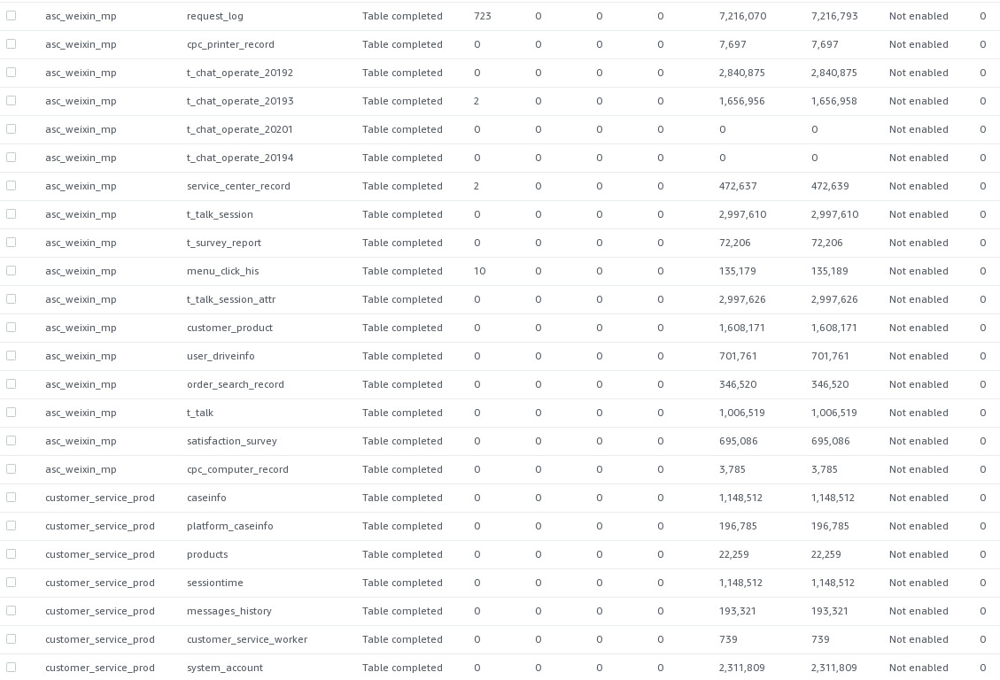

当前工作目录：

[C:\xujian\eipi10\a](C:\xujian\eipi10\ai)

### docker端口转发

目前没有测试成功

~~~shell
docker run --rm --name aws-port-proxy -v /home/grid/.ssh:/host_ssh  -it -p 28888:28888  ubuntu
echo Acquire::http::Proxy \"http://web-proxy.rose.hp.com:8080\"\; >> /etc/apt/apt.conf.d/proxy.conf
echo Acquire::https::Proxy \"http://web-proxy.rose.hp.com:8080\"\; >> /etc/apt/apt.conf.d/proxy.conf
cat /etc/apt/apt.conf.d/proxy.conf
apt update
apt-get install -y openssh-server
ssh -4 -i host_ssh/id_rsa  -L 28888:10.1.3.176:8080 xu6@54.222.229.186
~~~

### 查询端口映射

~~~
sudo iptables -t nat -L -n
~~~

DMS

