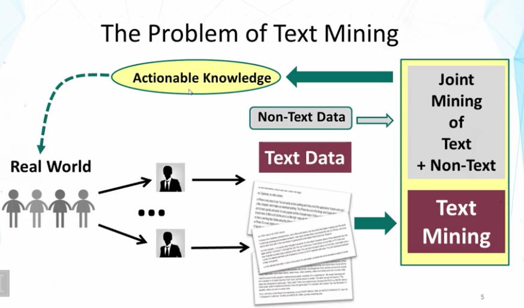
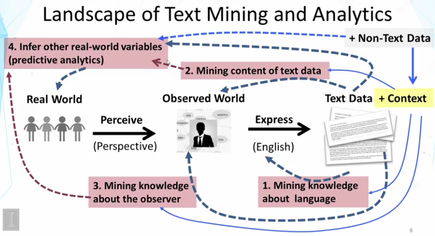
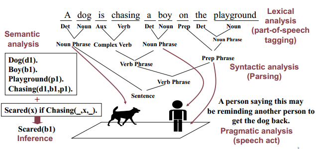
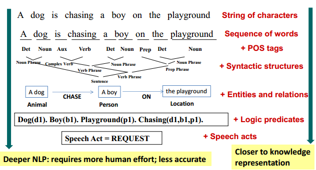
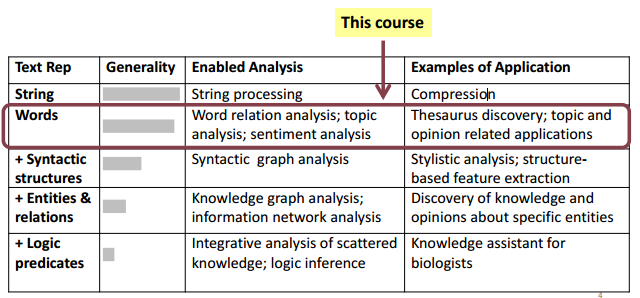
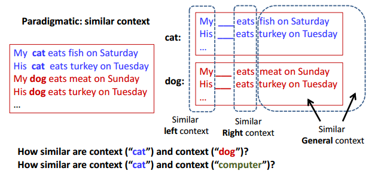
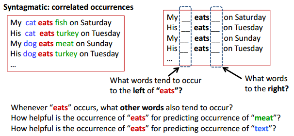

## 1.1 Overview Text Mining and Analytics

### 1.11 Text Mining和Text Analytics

**文本挖掘（Text Mining）**

Text Mining 几乎等同于 Text Analyics： 把文本数据转化成高质量的信息或可用的知识。

- 最小化人工（Minimizes human effort）
- 为决策支持提供更好的知识（Supplies knowledeg for optimal decision making）

**文本检索（Text Retrieval）**

Text Retrieval是Text Mining系统的必要组件。

- Text Retrieval是Text Mining之前的预处理器。把大量文本数据转化成小量的相关文本数据。
- Text Retrieval is needed for knowledge provenance。当在文本中发现某种模式和知识，通常还需要用Text Retrieval来到原始文本中进行查找，以验证这个模式和知识是可靠的。

### 1.12 Text 

文本数据是人类产生的，人类也象一个sensor一样来接受文本信息。

### 文本的重要性（textual information）

- 文本（自然语言）是人类知识的最天然的编码方式。    
Text (natural language) is the most natural way of encoding human knowledge.
- 文本是是人们最普遍的信息沟通方式。    
Text is by far the most common type of information encountered by people.
- 文本是用来描述视频和图片的最佳表现形式。   
Text is the most expressive form of information in the sense that it can be used to describe other media such as video or images. 

由于文本语义的丰富性和不确定性，只有人类才可以很好的识别其中情感的含义。这如同，温度计来得到温度，GPS来获取位置信息。

### 1.13 Text Mining的问题

### 1.14 Text Mining的现状

通过对真实世界(Real World)的观察，每个人的大脑中都有一个自己的Observerd World。通过文本，每个人来表达自己的observerd world。非文本信息为文本数据提供了上下文，非文本和文本的结合，能够更好的来推断真实世界。

1. 分析文本语法：发现其中的一些pattern
2. 理解文本含义
3. 分析观察者（人）
4. 推断/预测真实世界

### 1.15 Roadmap

在课程中，是按照下图的路线展开的。

## 1.2  自然语言处理（Natural Language Processing）

### 1.21 基本概念

- 词汇分析（lexical analysis）

- 语法分析（syntactic analysis）

- 语义分析（semantic analysis

  - 实体关系抽取（entity/relation extraction）

  - 词语消除歧义（word sense disambiguation）

  - 情感分析（sentiment analysis）

    

### 1.22 难度和挑战
为了有效的沟通，人们在表达时：
- 假定受众已经知道，所以省略了许多常识。
- 假定受众知道如何区分，所以有很多含糊的表达。

这使得NLP中的每一步都很难。比如以下的任务：

- 词汇含糊（Word-level  Ambiguity）
    - POS： design可以是名词也可以是动词
    - 含义：root有很多的含义
- 语法含糊（Syntactic Ambiguity）
    - natural language processing
        - 自然语言处理
        - 语言处理是自然的
    - a man saw a boy with a telescope
        - 介词短语归属（PP(prepositional phrase) attachment）
- 人称代词消解(anaphora resolution)
    - John presuaded Bill to buy a TV for himeself(himself = John or Bill?)
- 臆测(Presupposition)
    - "He has quit smoking" : 隐含他以前是抽烟的。

### 1.23 当前的水平（state of art ）

- 词汇分析（lexical analysis）: POS：97%  ,  无法做到100%
- 语法分析（syntactic analysis）: Parsing：90%， 无法做到General complete parsing
- 语义分析（semantic analysis）。可以分为以下的一些任务。
  - 实体关系抽取（entity/relation extraction）
  - 词语消除歧义（word sense disambiguation）
  - 情感分析（sentiment analysis）
  - Inference： 只能在特定领域来做
  - Speech act analysis： 用户的行为。只能在特定领域来做

  总体上，我们的现状是：

- NLP是Text Mining的基础
- 目前的技术还远远不能理解自然语言
  - Deep NLP需要常识和推理，目前还不够precise和robust，目前只能在特定领域做到，需要人工的帮助。
  - Shallow NLP基于统计方法，有很好的通用性，被广泛的应用。

- 实际中，NLP作为基础，人工的作用非常重要。

## 1.3  文本表示（Text Representation）

### 1.31 文本表示的层次

### 1.32 Enabled Analysis

总体上，我们认为：

- 存在多种文本表示的方式
  - 字符串，词汇，语法结构，实体-关系图（entity-relation graph)，预测模型
  - 这些文本方式可以混合起来使用

- 本课程的重点是word-based representation，它的优点是：
  - 通用而且健壮（General and robust）
  - 几乎不需要人工（No/little manual effort）
  - 其实已经很强大了，“Surprisingly” powerful for many applications (not all!)
  - 可以和其他更复杂的文本表示来合并使用（ Can be combined with more sophisticated representations ）

## 1.4 词汇联想(Word Association) Mining & Analysis

### 1.4.1 基本词汇关系（basic word relation）

- Paradigmatic （聚合关系）：A和B可以互相被替换B，意味A和B属于相同类别。比如：cat和dog，monday和wednesday，晴天和阴天，张三和李四。
- Syntagmatic （组合关系）：A和B合并在一起使用，意味着A和B有语义关联。比如：cat和sit， car和driver。

### 1.4.2 How to mine word associations 

- Paradigmatic: 相似的上下文（similar context ）

  - 用上下文来表示词汇（Represent each word by its context）
  - 计算上下文的相似度（Compute context similarity）
  - 上下文高度相似的词汇很可能paradigmatic （Words with high context similarity likely have paradigmatic relation）

  

- Syntagmatic: 关联出现（correlated occurrences ）

  - Count how many times two words occur together in a context (e.g.,
    sentence or paragraph)
  - Compare their co-occurrences with their individual occurrences
  - Words with high co-occurrences but relatively low individual occurrences
    likely have syntagmatic relation 

  

这两种关系的联系是：Paradigmatic词汇的syntagmatic词汇往往相同（Paradigmatically related words tend to have syntagmatic relation with the same word ）