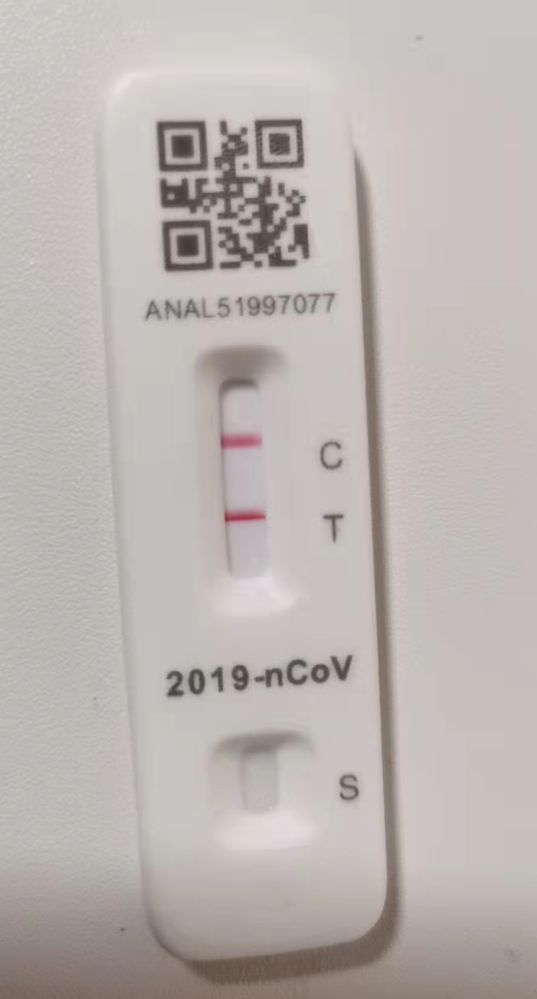
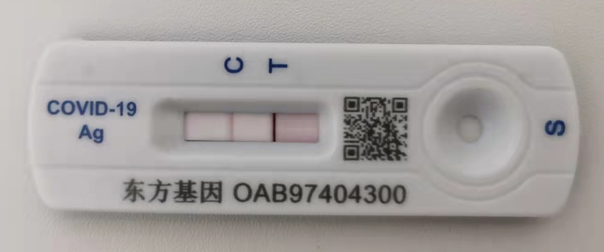

记录一下，这次生病的经历。非常感谢家人，朋友和同学对我的关心和支持，这让我感到有了无穷的力量。

### 疫苗

- 本人：两针
  - 2022-04-02 ：北京生物疫苗第一针，
  - 2022-04-04：北京生物疫苗第二针
- 孩子：两针，2022年3月 打的第二针
- 母亲和妻子：三针

### 2022-03-26 周六

- 自测抗原，全家阴性

- 和本楼志愿者有接触，他们家四人当天抗原阳性，后来核酸检测都是阳性。

  他们家好像也只打了两针疫苗。

- 楼栋单元被封。

### 2022-03-28 周一

- 全家核酸检测。这个核酸检测结果一直未出。

### 2022-03-30 周三

- 喉咙有点痒, 有一点头晕和乏力。
- 全家核酸检测，第二天结果出来，都是阴性

### 2022-03-31 周四

- 喉咙发干；有些头晕，全身乏力
- 大部分时间卧床休息。
- 吃阿咖酚散，
- 晚上工作了两个小时。

### 2022-04-01 周五

- 喉咙非常痛，像针扎；有一些发烧（38度左右）；头晕，全身无力；嗓子有些哑。

- 卧床休息。

- 吃阿咖酚散，下午开始吃连花清瘟胶囊

- 自测抗原阳性。家人都是阴性，且没有任何异样。

  

- 开始被隔离在单独房间。

- 电脑不知道怎么被水泼了，无法启动。

### 2022-04-02 周六

- 喉咙非常痛，像针扎；有一些发烧（38度左右）；头晕，全身无力；嗓子非常哑。
- 卧床休息。
- 吃连花清瘟胶囊。
- 个人核酸检测。这个核酸检测结果一直未出。
- 飘窗晒电脑。试了很多次，无法开机，直到晚上睡觉前，又试了一下，启动了。看来和我一样，复活了。

### 2022-04-03 周日

- 喉咙不太痛了；体温37度左右；有时会咳黄痰；有轻微鼻塞。
- 一半时间卧床，可以打游戏了。
- 吃连花清瘟胶囊。

### 2022-04-04 周一

- 喉咙完全不痛了，有点发干；

  - 上午，咳嗽很厉害，痰多，黄白色；鼻塞，鼻涕多。体温36.4度
  - 下午开始连续喷嚏，痰白色，带一点黄。体温36.8度

- 精力感觉基本恢复了。

- 吃连花清瘟胶囊。下午开始吃清肺消炎丸。

- 自测抗原阳性

  

### 2022-04-05 周二

- 和昨天症状相同，所有方面都有所减轻，痰基本是白色的。上午体温36.6。
- 精力感觉和昨天差不多
- 只吃清肺消炎丸。
- 晚上8：44分解到居委会电话，

