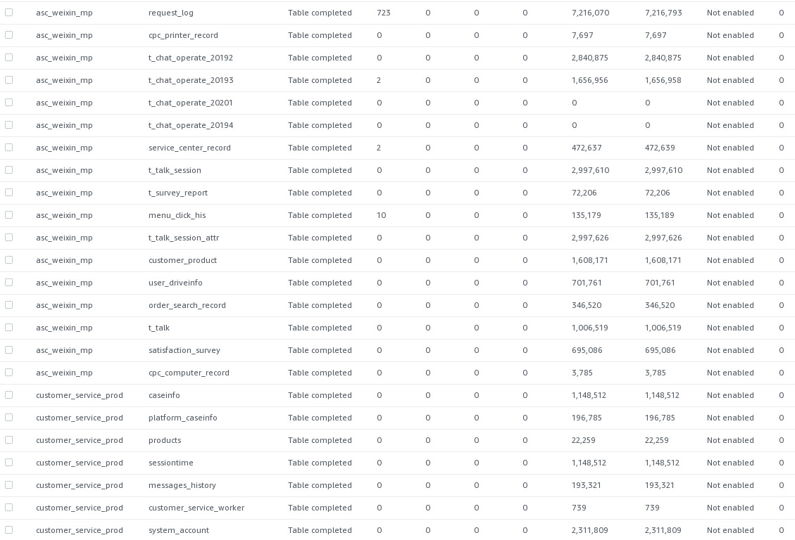

## 2020-03-09

- KDE 核密度估计
  - 监控指标异常检测之KDE https://zhuanlan.zhihu.com/p/97225135
  - 
- 智能运维比赛 http://iops.ai/
  - [AIOps挑战赛决赛 暨 第二届AIOps研讨会-div](https://workshop.aiops.org/#2019%20AIOps%E6%8C%91%E6%88%98%E8%B5%9B%E5%86%B3%E8%B5%9B%20%E6%9A%A8%20%E7%AC%AC%E4%BA%8C%E5%B1%8AAIOps%E7%A0%94%E8%AE%A8%E4%BC%9A-div)

- 关于日志分析的一些很好的内容
  - 软件工程角度的日志分析领域研究现状 https://zhuanlan.zhihu.com/p/66586315
    - 大规模软件系统日志研究综述 http://www.jos.org.cn/jos/ch/reader/create_pdf.aspx?file_no=4936&journal_id=jos
  - 清华大学裴丹教授的FT-tree
  - 犹他大学李飞飞教授的DeepLog/Spell、
  - 港中文郑子彬教授的Drain
  - 南京邮电李涛教授的FLAP

## 2020-03-02

- [Introduction to Data Science in Python](https://www.coursera.org/learn/python-data-analysis/home/welcome) 又不小心付了钱，看来必须要学完，不然太亏了

- [Fundamentals of Reinforcement Learning](https://www.coursera.org/learn/fundamentals-of-reinforcement-learning) 强化学习基础，这时系列的4门功课，评分高达4.8分，值得学习。

- [BerkeleyX: CS188.1xArtificial Intelligence](https://courses.edx.org/courses/BerkeleyX/CS188.1x-4/1T2015/course/) EDX课程，评分不错，不过有些老。

- Linear Models： 但是以下两个课程没有练习。

  - [Advanced Linear Models for Data Science 1: Least Squares](https://www.coursera.org/learn/linear-models#syllabus)  评分4.4，线性回归基础
  - [Advanced Linear Models for Data Science 2: Statistical Linear Models](https://www.coursera.org/learn/linear-models-2/home/welcome)  评分4.6，对于线性回归，有比较详细的分析，这些内容正好丰富自己对于基础知识的掌握

  

## old

当前工作目录：

[C:\xujian\eipi10\a](C:\xujian\eipi10\ai)

https://course.fast.ai/index.html

### docker端口转发

目前没有测试成功

~~~shell
docker run --rm --name aws-port-proxy -v /home/grid/.ssh:/host_ssh  -it -p 28888:28888  ubuntu
echo Acquire::http::Proxy \"http://web-proxy.rose.hp.com:8080\"\; >> /etc/apt/apt.conf.d/proxy.conf
echo Acquire::https::Proxy \"http://web-proxy.rose.hp.com:8080\"\; >> /etc/apt/apt.conf.d/proxy.conf
cat /etc/apt/apt.conf.d/proxy.conf
apt update
apt-get install -y openssh-server
ssh -4 -i host_ssh/id_rsa  -L 28888:10.1.3.176:8080 xu6@54.222.229.186
~~~

### 查询端口映射

~~~
sudo iptables -t nat -L -n
~~~

DMS

